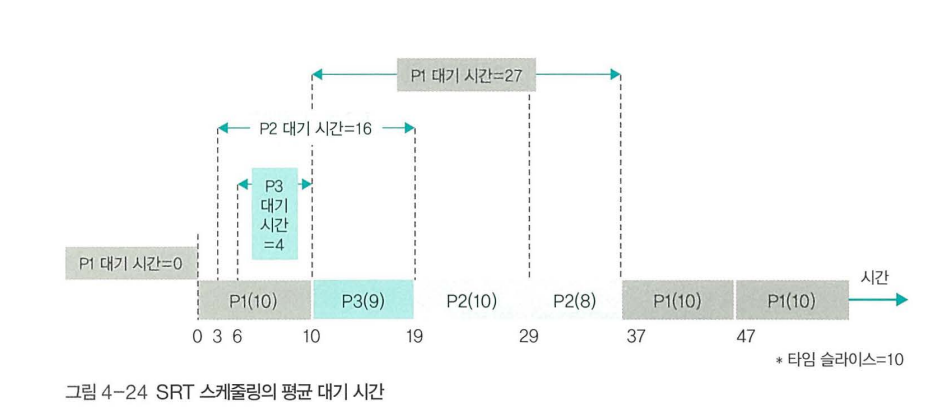

# CPU 스케줄링

CPU 스케줄링은 어떤 작업에 CPU를 배정할 지 결정하는 것

## 1. 스케줄링의 개요

### 스케줄링의 단계

- 고수준(장기) 스케줄링 : 시스템 내 전체 작업 수 조절(프로세스 갯수 조절). 
- 저수준(단기) 스케줄링 : 프로세스에 CPU 할당
- 중간수준 스케줄링 : 중지, 활성화로 장기 단기 사이의 완충

### 스케줄링의 목적

- 공평성 : 모든 프로세스가 공평하게 자원을 갖는 지
- 효율성 : 유휴시간이 적은 지
- 안정성 : 우선순위가 높은 프로세스가 먼저 작동하는 지
- 확장성 : 프로세스가 증가해도 안정적으로 작동하는 지
- 반응 시간 보장 : 사용자의 대기 시간이 너무 길어지지 않는 지
- 무한 연기 방지 : 무한히 대기하지 않는 지

## 2. 스케줄링 시 고려 사항

### 선점형 스케줄링과 비선점형 스케줄링

- 선점형 스케줄링 : 인터럽트 작동으로 자원을 뺏을 수 있음
- 비선점형 스케줄링 : 뺏을 수 없음

### 프로세스 우선순위

- 대체로 커널 프로세스 > 일반 프로세스
- 우선순위에 따라 더 자주, 빨리 실행될 수 있음
- 사용자가 우선순위를 조정할 수 있으나 유닉스의 경우 권한이 관리자에게만 있음

### CPU 집중 프로세스와 입출력 집중 프로세스

- CPU 집중 프로세스 : 연산을 주로 하는 프로세스
- 입출력 집중 프로세스 : 입출력을 주로 하는 프로세스. 우선순위가 높으면 처리 효율적. 입출력 프로세스가 CPU 프로세스보다 먼저 들어 가는 것을 사이클 훔치기라고함

### 전면 프로세스, 후면 프로세스

- 전면 프로세스 : GUI가 있는 os에서 화면 맨 앞에 놓인 프로세스. 사용자와 상호작용이 가능
- 후면 프로세스 : 그 외의 프로세스. 상호작용 불가능

## 3. 다중 큐

### 준비 상태의 다중 큐

- 준비 상태를 우선순위별로 큐를 만들어 관리를 편하게 만든 것. 항상 뒤에 삽입되고, 앞에서 하나씩 처리한다.

- 고정 우선순위 방식 : 우선 순위를 변경하지 않는 방식. 구현하기 쉽다.
- 변동 우선순위 방식 : 우선 순위를 변경하는 방식. 구현하기 어렵다. 낮은 우선 순위를 높은 우선 순위로 바꾸는 것을 반전 우선 순위라고 한다.

### 대기 상태의 다중 큐

- 같은 장치의 입출력을 요구하는 프로세스끼리 모아놓는 큐. 준비상태와 다르게 한 번에 입출력된다. 동시에 끝나는 인터럽트를 처리하기 위해 인터럽트 벡터라는 자료 구조를 사용한다.

## 4. 스케줄링 알고리즘

크게 비선점형과 선점형으로 나뉜다. 비선점형은 효율이 떨어져서 잘 사용되지 않는다.

### 스케줄링 알고리즘의 선택 기준

- CPU 사용률 : CPU가 사용된 시간을 측정하는 방법. 가장 이상적인 수치는 100%이나 이에 못미침
- 처리량 : 단위시간당 작업을 마친 프로세스의 수. 수치가 클 수록 좋다
- 대기 시간 : 요청한 시간에서 작업을 시작하기전까지 대기한 시간. 짧을수록 좋다.
- 응답 시간 : 첫 번째 출력 또는 반응이 나오는 시간
- 실행 시간 : 작업이 시작해서 종료되기까지 걸리는 시간
- 반환 시간 : 대기 시간 + 실행 시간

스케줄링 알고리즘의 성능 측정은 주로 평균 대기 시간을 본다. 평균 대기 시간은 각각의 프로세스 대기 시간을 더한 것을 프로세스의 수로 나눈 시간을 말한다. 스케줄링 알고리즘의 성능은 절대적인 지표가 될 수 없다.

프로세스 예제

## 비선점형 방식

### FCFS 스케줄링

- First Come First Served. 먼저 들어온 것을 먼저 처리함. FIFO라고도 한다
- 작업 시간이 긴 프로세스를 처리할 때, 다른 프로세스가 오래 기다림. 콘보이 또는 호위 효과라고 함

### SJF 스케줄링

- Shortest Job First. 가장 짧은 것을 먼저 처리함
- 종료 시간을 예측하기 힘듦
- 작업 시간이 긴 프로세스는 무한정 기다림. 아사 또는 무한 봉쇄 현상이라고 함
- 에이징. 어느 정도 나이를 먹으면 무조건 실행하는 방법으로 해결 가능하나 기준이 불명확

### HRN 스케줄링

- Highest Response Ratio Next. (대기시간 + CPU 사용시간)/CPU 사용시간을 우선순위 기준으로 처리함
- 작업 시간이 짧으면 우선순위가 높고, 대기 시간을 어느 정도 고려하여 아사 방지

## 선점형 방식

### 라운드 로빈 스케줄링

- Round Robin. 타임 슬라이스만큼 작업 후, 준비 큐의 맨 뒤로 가서 차례를 기다리는 방식
- 우선순위가 적용되지 않음
- 타임슬라이스가 너무 크면 비선점형 방식같이 움직이고, 작으면 문맥 교환이 많아져 비효율적이게 되므로 적당히 설정해야된다. 10~200ms 권장, 유닉스에서는 100ms

### SRT 스케줄링

- Shortest Remaining Time. 시간이 가장 적게 남은 프로세스를 먼저 처리함
- SJF의 선점형 버전

### 우선 순위 스케줄링

- 우선 순위가 높은 프로세스를 선점하여 먼저 처리하는 방식
- 우선 순위를 어떻게 설정하는가에 따라 SJF, HRN, SRT를 구현할 수 있다
- 커널 프로세스보다 일반 프로세스가 중요도가 높을 경우 커널 프로세스가 제 역할을 못할 수 있다

### 다단계 큐 스케줄링

- Multilevel Queue. 우선 순위에 따라 여러 개의 큐를 사용
- 우선순위가 높은 것을 모두 처리해야 다음 우선순위로 넘어가는 방식
- 각각의 큐에서는 라운드 로빈 방식으로 처리한다

### 다단계 피드백 큐 스케줄링

- Multilevel Feedback Queue. 다단계 큐 스케줄링의 낮은 프로세스에 불리한 점을 보완한 방식
- 한 번 CPU를 사용한 프로세스는 우선순위가 낮아진다(커널->일반은 x)
- 우선순위가 낮을 수록 타임 슬라이스가 커짐

## 인터럽트 처리

### 인터럽트의 개념

- 순차적 프로그래밍에서 주기적으로 직접 확인하는 과정이 비효율적이어서 나온 개념
- 버튼이 눌리면 프로세스에 알려주는데 이를 이벤트 드리븐이라고 함
- 입출력과 같은 개념을 요청하고, 완료되었을 때 이벤트를 발생시키는데 이를 인터럽트라고 함

### 동기적 인터럽트와 비동기적 인터럽트

- 동기적 인터럽트 : 사용자가 명령어를 실행시켰을 때 나오는 인터럽트
- 비동기적 인터럽트 : 명령어와 무관하거나 하드웨어에서 나오는 인터럽트

### 인터럽트 처리 과정

- 인터럽트가 발생하면 현재 프로세스를 정지하고 인터럽트 벡터를 우선순위에 따라 연속적으로 처리함
- 시스템에 고유한 인터럽트 번호가 있는데 IRQ라고 함
- IRQ 1:1로 연결된 인터럽트 핸들러에서 인터럽트를 처리한다
- 인터럽트 종류가 오류일 경우 프로세스를 종료하고, 오류가 아닐 경우 인터럽트가 완료되면 정지했던 프로세스를 다시 실행시킨다

### 인터럽트와 이중 모드

- 프로세스는 커널 프로세스와 사용자 프로세스로 나뉜다
- 사용자 프로세스가 커널의 기능을 사용하려면 시스템 콜을 이용해야 하는데, 사용자 프로세스를 대기 상태로 만들고 커널에서 프로세스를 처리하는데 이를 이중 모드라고 한다.

    