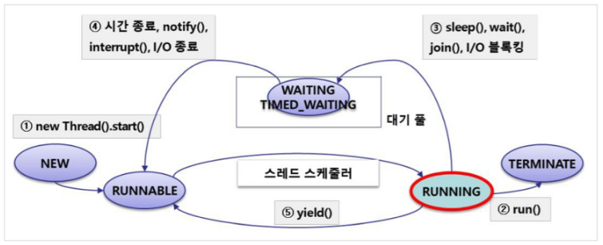
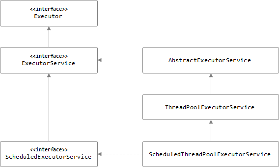

# JAVA THREAD

## 자바의 비동기

일반적으로 자바 애플리케이션을 만들어 실행하면 1개의 메인(main) 쓰레드에 의해 프로그램이 실행된다. 하지만 1개의 쓰레드 만으로는 동시에 여러 작업을 할 수 없다. 동시에 여러 작업을 처리하고 싶다면, 별도의 쓰레드를 만들어 실행시켜줘야 하는데, 자바는 멀티 쓰레드 기반으로 동시성 프로그래밍을 지원하기 위한 방법들을 계속해서 발전시켜 왔다.

## Thread의 상태



| 상태 | 열거상수 |  |
| --- | --- | --- |
| 객체 생성 | NEW | 쓰레드 객체 생성 |
| 실행 대기 | RUNNABLE | 스케줄링 되지 않아 실행을 기다리고 있는 상태 |
| 일시 정지 | WAITING | 다른 스레드의 notify를 기다리는 상태 |
| 일시 정지 | TIMED_WAITING | 주어진 시간 동안 기다리는 상태 |
| 일시 정지 | BLOCKED | 사용하고자 하는 객체의 락이 풀릴 때 까지 기다리는 상태 ( 동기화 문제 ) |
| 종료 | TERMINATED | 실행을 마친 상태 |

## Thread 사용법

### 1. Thread 클래스 상속

```jsx
public class Sample extends Thread {
    public void run() {  // Thread 를 상속하면 run 메서드를 구현해야 한다.
        System.out.println("thread run.");
    }

    public static void main(String[] args) {
        Sample sample = new Sample();
        sample.start();  // start()로 쓰레드를 실행한다.
    }
}
```

### 2. Runnable 인터페이스 구현

```jsx
import java.util.ArrayList;

public class Sample implements Runnable {
    int seq;
    public Sample(int seq) {
        this.seq = seq;
    }
		@Override
    public void run() {
        System.out.println("thread run.");
    }

    public static void main(String[] args) {
		    Thread t = new Thread(new Sample(i));
		    t.start();

				Thread t = new Thread(
                new Runnable() {
                    @Override
                    public void run() {
                        System.out.println("5");
                    }
                }
        );
    }
}
```

<aside>
💡 차이점

Thread를 상속 받으면 다른 클래스를 상속받지 못한다.

Thread를 상속 받으면 run 메서드가 종료시 가비지 컬렉션으로 넘어가 재사용이 불가능 

</aside>

```java
public synchronized void start() {
		//쓰레드가 실행 가능한지 검사
		//new 상태가 아니라면 예외
    if (threadStatus != 0)
        throw new IllegalThreadStateException();
		//쓰레드를 쓰레드 그룹에 추가
    group.add(this);

    boolean started = false;
    try {
				//native메서드로 선언
				//JVM에 의해 호출
				//쓰레드 Runnable로 변경
        start0();
        started = true;
    } finally {
        try {
            if (!started) {
                group.threadStartFailed(this);
            }
        } catch (Throwable ignore) {
        
        }
    }
}
```


start - 쓰레드 시작

run - 쓰레드의 로직 시작

sleep - 주어진 시간동안 일시 정지

join - 다른 쓰레드가 종료될때까지 대기

yield - 다른 쓰레드에게 양보(호출한 쓰레드는 실행대기 상태로 돌아가고 다른 쓰레드 실행)

wait - 쓰레드를 일시정지 상태로 전환

notify - 랜덤한 일시정지상태의 쓰레드를 실행 대기 상태로 전환

notifyAll - 모든 일시정지상태의 쓰레드를 실행 대기 상태로 전환

<aside>
💡 wait, notify, notifyAll는 synchronized 에서만 사용 가능

</aside>

interrupt 

- stop() 메서드를 사용해 종료시키면 자원이 불안정상 상태로 남겨짐
- 쓰레드가 정지 상태에 있을 시 InterruptedException이 발생하여 catch문으로 이동

```java
class TestThread extends Thread{
	
	@Override
	public void run(){
		try {
			while(true){
				System.out.println("무한 실행");
				Thread.sleep(1); // InterruptedException 발생 => 예외 처리(catch) 블록으로 이동
			}
		} catch (InterruptedException e) {}
		System.out.println("실행 종료");
	}
}

public class ThreadTest {
	
	public static void main(String[] args) {

		TestThread thread = new TestThread();
		thread.start();
		
		// 0.5초 후에 스레드를 종료
		try {
			Thread.sleep(500);
		} catch (InterruptedException e) {
			e.printStackTrace();
		}
		
		thread.interrupt();
	}
}
```

```java
class TestThread extends Thread{
	
	@Override
	public void run(){
		while(true){
			System.out.println("무한 실행");
			if(Thread.interrupted()){
				break;
			}
		}
		System.out.println("실행 종료");
	}
}
```

### 우선순위

```java
public final static int MIN_PRIORITY = 1;
public final static int NORM_PRIORITY = 5;
public final static int MAX_PRIORITY = 10;

System.out.println("Priority of t1: " + t1.getPriority());
t1.setPriority(Thread.MIN_PRIORITY)
```

## 동기화

여러 개의 쓰레드가 한 개의 자원을 사용할 때, 하나의 쓰레드만 제외하고 나머지의 접근을 막는 것 

### Synchronized

1. 메서드에 synchronized 하기

- synchronized 를 붙이면 메소드 전체가 임계 영역으로 설정된다.

- 쓰레드는 synchronized 메소드가 호출된 시점부터 해당 메소드가 포함된 객체의 Lock을 얻어 작업을 수행하다가 메소드가 종료되면 Lock 을 반환한다.

```java
public synchronized String getData() { // 소비자 쓰레드가 호출
        if (this.data == null) { // 데이터를 읽을 수 없으니까 wait 으로 만든다.
            try {
                wait(); // 생성자 쓰레드가 데이터를 넣어줄 때가지 일시 정지된다.

            } catch (InterruptedException e) {
            }
        }
        String returnValue = data;
        System.out.println("ConsummerThread가 읽은 데이터: " + returnValue);
        data = null; // 데이터를 읽었으니까 null 로 만든다.
        notify(); // notify()를 호출해서 현재 일시정지 상태에 있는 생성자 쓰레드를 실행 대기 상태로 만든다.
        return returnValue;
    }
```

2. 블록에 synchronized 하기

- 메소드 내의 코드 일부를 블럭{} 으로 감싸고 블럭 앞에 synchronized를 붙이는 것이다.

- 이때 참조변수는 Lock 을 걸고자 하는 객체를 참조하는 것이어야 한다.

- 이 영역 안으로 들어가면서부터 쓰레드는 지정된 객체의 Lock 을 얻게 되고, 이 블럭을 벗어나면 Lock 을 반납한다.

```java
public void run() {
    synchronized (this) { // 해당 객체(this)에 Lock 이 걸린다.
        for (int i = 0; i < 5; i++) {
            System.out.println(i + "를 더한다.");
            total += i;

            try {
                Thread.sleep(500);
            } catch (InterruptedException e) {
                e.printStackTrace();
            }
        }
        notify(); // 위 작업이 모두 끝나면 notify()를 호출하여 다른 쓰레드를 실행 대기 상태로 만든다.
    }
}
```

### Volatile


- Multi Thread 환경에서 하나의 Thread만 read & write하고 나머지 Thread가 read하는 상황에서 가장 최신의 값 보장
- CPU 캐시보다 메인 메모리가 비용이 더 크기 때문에 변수 값 일치를 보장해야 할 때만 사용

```java
public volatile int counter = 0;
```

### Atomic

- CAS(Compare And Swap)방식으로 값을 변경하기 전에 기존의 값과 비교 후 같으면 새로운 값 할당
- Primitive Type (int, boolean, char, byte, short 등) 읽기/쓰기 , 단 long, double은 제외
- long, double의 경우 내부적으로 소수점을 중심으로 왼쪽 오른쪽을 나누어서 2개로 내부 value 관리함
- compareAndSet(int expect, int update)
- getAndSet(int update)
- incrementAndGet()
- accumulateAndGet(int x, IntBinaryOperator accumulatorFunction)

```java
private AtomicBoolean locked = new AtomicBoolean(false);
  
public boolean lock() {
	return locked.compareAndSet(false, true);
}
```

| Synchronized | Volatile | Atomic |
| --- | --- | --- |
| 메소드와 블럭단위로 처리 가능 | 변수에만 가능 | 변수에만 가능 |
| lock으로 인해 상대적으로 낮은 성능 | synchronized보다 높은 성능 | volatile 와 synchronized보다 높은 성능 |
| 교착 상태 발생 가능 | lock이 없어서 교착상태 면역 | lock이 없어서 교착상태 면역 |
| race condition 해결 | race condition 해결불가 | race condition 해결불가 |

race condition (여러 개의 쓰레드가 동시에 경쟁하는 경우)

두번쨰는 Visibility (메모리 가시성)

### 문제점

- 지나치게 저수준의 API(쓰레드의 생성)에 의존함
- 값의 반환이 불가능
- 매번 쓰레드 생성과 종료하는 오버헤드가 발생
- 쓰레드들의 관리가 어려움

## Callable

```java
@FunctionalInterface
public interface Callable<V> {
    V call() throws Exception;
}
```

## Future

```java
public interface Future<V> {
		//작업 취소
    boolean cancel(boolean mayInterruptIfRunning);
		//작업의 취소 여부 반환
    boolean isCancelled();
		//작업의 완료 여부 반환
    boolean isDone();
		//작업의 결과를 가져옴
    V get() throws InterruptedException, ExecutionException;
		//타임아웃 설정
    V get(long timeout, TimeUnit unit)
        throws InterruptedException, ExecutionException, TimeoutException;
}
```

Future는 비동기 작업을 갖고 있어 미래에 실행 결과를 얻도록 도와준다

## Executor

쓰레드 풀을 위한 클래스 등장



```java
public class ExecutorServiceTest {

    public static void main(String args[]) {
        final int maxCore = Runtime.getRuntime().availableProcessors();
        final ExecutorService executor = Executors.newFixedThreadPool(maxCore);
        final List<Future<String>> futures = new ArrayList<>();

        for (int i = 1; i < 5; i++) {
            final int index = i;
						//runnable, callable 모두 가능
            futures.add(executor.submit(() -> {
                System.out.println("finished job" + index);
                return "job" + index + " " + Thread.currentThread().getName();
            }));
        }

        for (Future<String> future : futures) {
            String result = null;
            try {
                result = future.get();
            } catch (InterruptedException e) {
                e.printStackTrace();
            } catch (ExecutionException e) {
                e.printStackTrace();
            }
            System.out.println(result);
        }

        executor.shutdownNow();
    }
}
```

## complatablefuture

### future의 단점

- 외부에서 완료시킬 수 없고, get의 타임아웃 설정으로만 완료 가능
- 블로킹 코드(get)를 통해서만 이후의 결과를 처리할 수 있음
- 여러 Future를 조합할 수 없음 ex) 회원 정보를 가져오고, 알림을 발송하는 등
- 여러 작업을 조합하거나 예외 처리할 수 없음

### **비동기 작업 실행**

- runAsync

```java
@Test
void runAsync() throws ExecutionException, InterruptedException {
    CompletableFuture<Void> future = CompletableFuture.runAsync(() -> {
        System.out.println("Thread: " + Thread.currentThread().getName());
    });

    future.get();
    System.out.println("Thread: " + Thread.currentThread().getName());
}
```

- supplyAsync

```java
@Test
void supplyAsync() throws ExecutionException, InterruptedException {

    CompletableFuture<String> future = CompletableFuture.supplyAsync(() -> {
        return "Thread: " + Thread.currentThread().getName();
    });

    System.out.println(future.get());
    System.out.println("Thread: " + Thread.currentThread().getName());
}
```