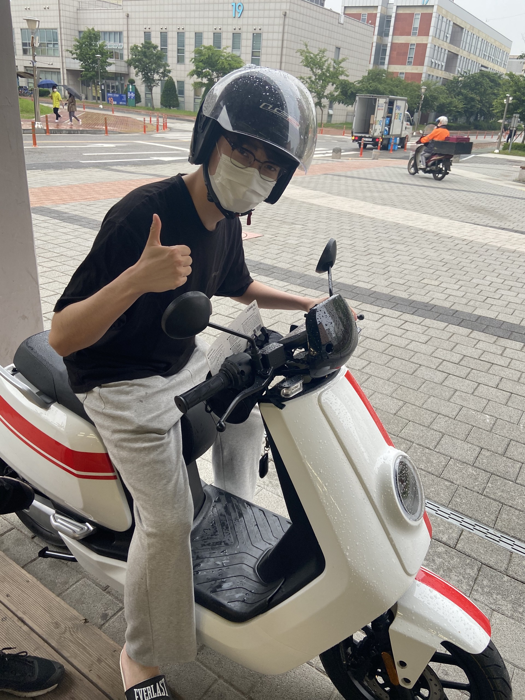
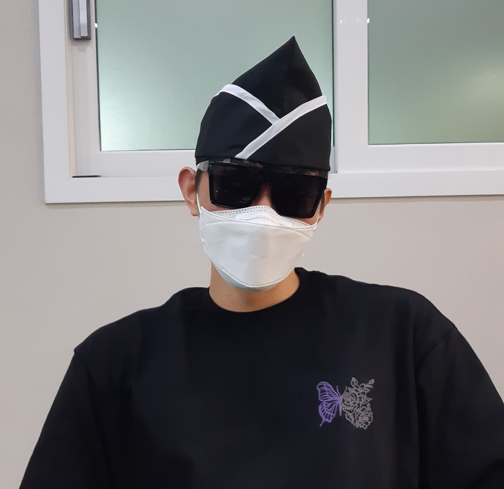
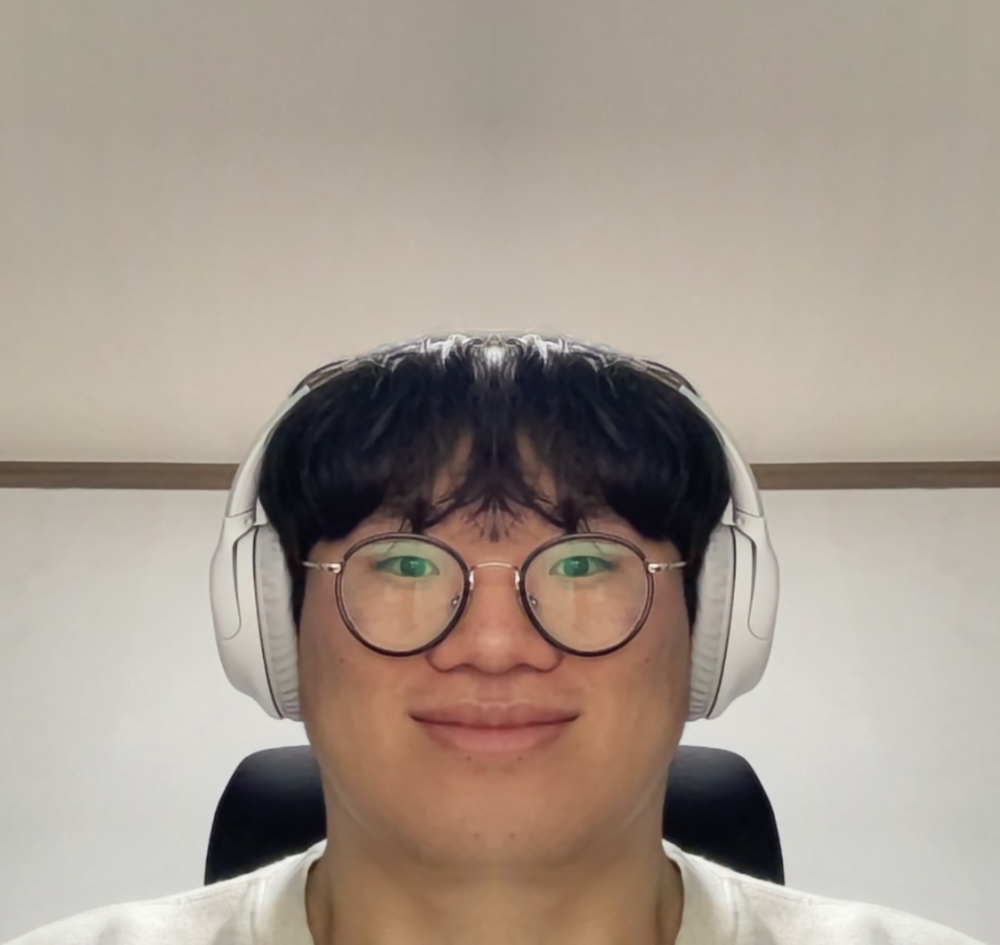
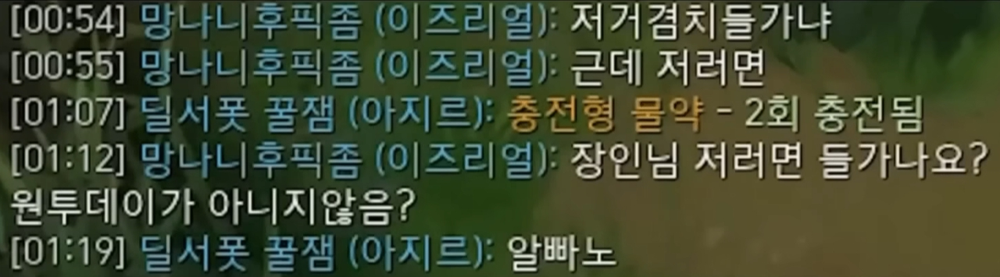

# 🤟🏿릴-야미(Lil Yummy)

---

> “그래서 우리 스터디 언제함?”  
> ”슬슬 스터디 시작해야하지 않나?”

허구한날 맨날 모여서 스터디에 대한 고민만 하다가 드디어 만들어버린
지식탐구 및 면접을 위한 CS스터디

**Lil Yummy**입니다.

# 1. 진행 순서

---

## 1.1 운영체제

-   쉽게 배우는 운영체제(한빛미디어) 기반 진행
-   인당 주 1회 한 `Chapter` 공부 및 리뷰
-   발표 후 질의응답 수행
-   챕터별 현황

    
1주차 (10.03 ~ 07.09)

| 22.10.04 | 22.10.04 | 22.10.06 | 22.10.06 |
| :------: | :------: | :------: | :------: |
| Chapter 3  프로세스와 스레드 | Chapter 5 프로세스 동기화 | Chapter 4  CPU 스케쥴링 | Chapter 6 교착 상태 |
| 신동희 | 이인재 | 장지웅 | 류한민 |
    

    
2주차 (10.10 ~ 10.16)

| 22.10.11 | 22.10.11 | 22.10.13 | 22.10.13 |
| :------: | :------: | :------: | :------: |
| Chapter 7  물리 메모리 관리 | Chapter 8 가상 메모리 기초 | Chapter 9  가상 메모리 관리 | Chapter 10 입출력 장치와 저장장치 |
| 신동희 | 이인재 | 장지웅 | 류한민 |
    

    
3주차 (10.17 ~ 10.23)

| 22.10.20 | 22.10.20 | 
| :------: | :------: | 
| Chapter 11  파일 시스템 | Dispatcher Servlet | 
| 이인재 | 류한민 | 
    

## 1.2 Spring

- 공식 문서 기반 기능 설명
- 동작 위주의 설명

    
3주차 (10.24 ~ 10.30)

| 22.10.28 | 22.10.28 | 22.10.28 | 22.10.28 |
| :------: | :------: | :------: | :------: |
| Spring file | Spring interceptor | Spring AOP | Spring Servlet |
| 신동희 | 이인재 | 장지웅 | 류한민 |
    

    
5주차 (11.07 ~ 11.13)

| 22.11.07 | 22.11.07 | 22.11.07 | 22.11.07 |
| :------: | :------: | :------: | :------: |
|  | Pattern | Annotation | Thread |
| 신동희 | 이인재 | 장지웅 | 류한민 |
    

| 22.11.12 | 22.11.12 | 22.11.12 | 22.11.12 |
| :------: | :------: | :------: | :------: |
| JAVA GC | JAVA Pattern | JAVA Annotation | JAVA Thread |
| 신동희 | 이인재 | 장지웅 | 류한민 |
    

## 1.3 네트워크

-   운영체제 끝나고 갱신 예정

## 1.4 데이터베이스

-   네트워크 끝나고 갱신 예정

# 2. 구성원

---

일단은 나이순 정렬입니다.

| <a href="https://github.com/zlzlelzl">장지웅</a>                              | <a href="https://github.com/easydong02">신동희</a> | <a href="https://github.com/ryuhm48">류한민</a> | <a href="https://github.com/ingkoon">이인재</a> |
| ----------------------------------------------------------------------------- | -------------------------------------------------- | ----------------------------------------------- | ----------------------------------------------- |
|  | |  |  |
|   디마장(본인 맞음)   |   엉덩희(당시 무면허)   |   류한민(27세, 무직)   |   광대(목둘레 80cm)   |

# 3. PR 규칙

---

각자 하는 스터디만 해도 PR규칙이 수두룩합니다.
우리는 그냥 편하게 살려고요.
그냥 `main`에다 때려박으세요

# 4. 디렉토리 구조

---

`lil-yummy/Chapter3(프로세스와스레드)/chapter3_프로세스_스레드.md`

위와 같은 예시로 작성하면 됩니다.

`챕터` + `마크다운파일`

# 5. 발표 규칙

---

SSAFY 온라인 강의가 있는날 저녁 8시부터 한시간 가량 진행됩니다!

일별 2명이 발표를 진행하며 내용발표 및 질의응답이 30분을 넘지 않도록합니다.
