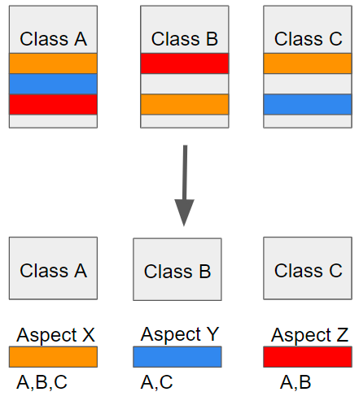
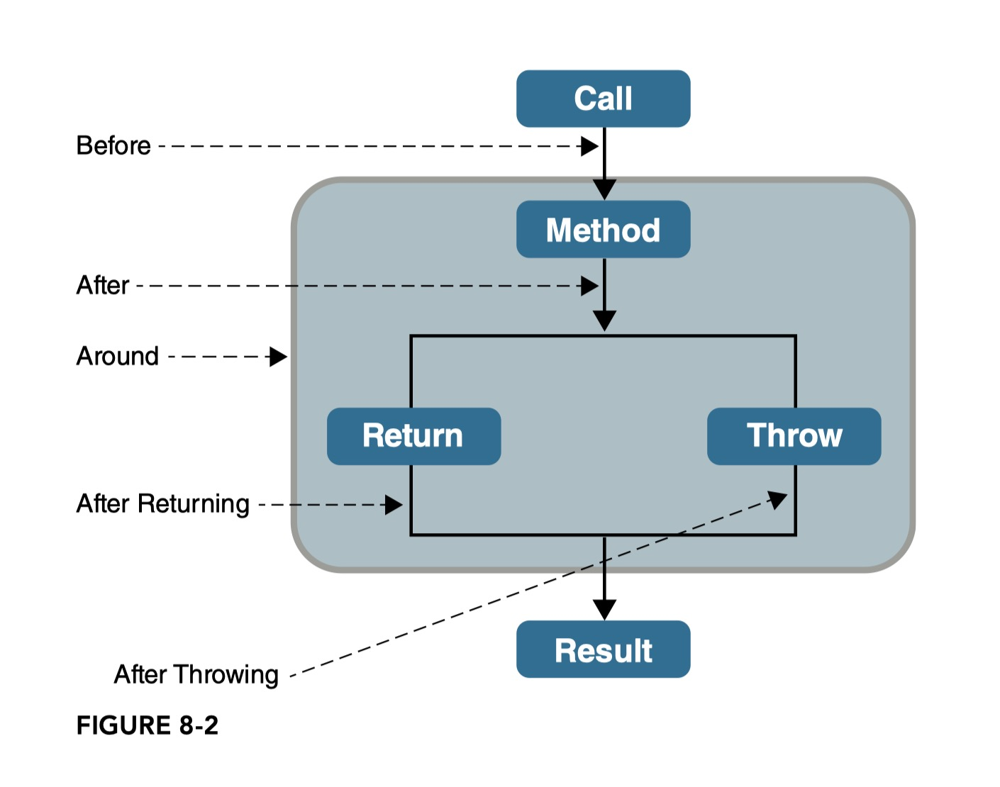
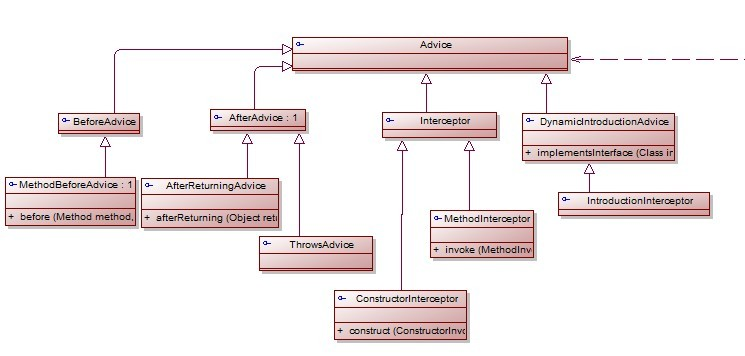
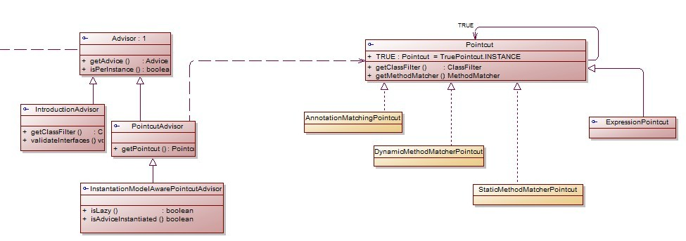
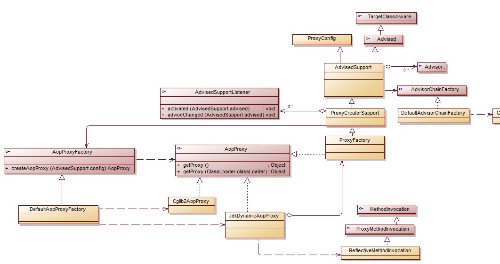
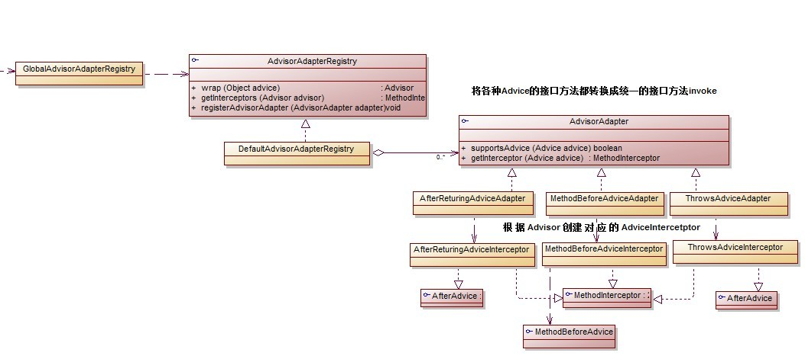

# AOP

## 개요

- Aspect-Oriented Programming
- 관점이 객체 지향 프로그래밍과 완벽히 일치하지 않아서 관점 단위로 모듈화 시킨 것
- 객체 지향 프로그래밍에 관점을 추가하여 보완

## AOP 사용 이유

- 엔터프라이즈 개발을 할 때 메인 로직보다 cross-cutting 부분을 더 많이 사용함
- cross-cutting 부분이 늘어날수록 코드 관리가 힘들어짐
- 메인 로직이 완성된 경우 cross-cutting을 끼워넣기 어려워짐

## 용어

- POJO : 특정 프레임워크에 종속되지 않은 순수한 자바 객체
- PSA : 잘 만든 추상화 구조(인터페이스)
- IoC/DI : 스프링에서 동적으로 기존 자바 객체에 멤버를 넣어주는 것
- Spring AOP : 스프링에서 관점을 쉽게 구현하기 위해 AspectJ 프레임워크를 벤치마킹함
- AspectJ : 자바에서 관점을 쉽게 구현할 수 있게 도와주는 프레임워크

### AOP 용어

- Aspect : 관점, 관심사. 자바 프로그래밍에서 cross-cutting 문제가 자주 발생하는 개념들
- cross-cutting concern(ccc) : 횡단 관심사. 여러 부분에서 같은 관심사를 사용하는 것. 공통 기능(<-> core concern(cc) : 메인 로직)
- Join point : 각 메서드 사이의 지점들. 스프링에서는 메서드를 실행할때를 말함
- Pointcut : Join point에 Advice를 끼워넣는 것. AspectJ 표현식이 일치하는 pointcut의 Advice를 실행함
- Advice : 끼워넣을 로직. Around, Before, After등의 타입 존재
- Advisor : Advice와 Pointcut을 하나로 묶어 다루는 것
- Target : Advice가 적용될 객체
- Weaving : 관점을 삽입시키는 행위. Spring AOP는 Run-time Weaving만 가능
- Proxy : 기존 메서드를 래핑하는것. Spring AOP는 기본적으로 JDK dynamic proxy를 사용



### 주의점

- AOP(프로그래밍 패러다임) != Spring AOP(프레임워크의 기능)
- Spring AOP != AspectJ(독립적인 프레임워크)
- Spring AOP > Transactional, Logger... (자주 쓰여서 미리 만들어놓은 기능들)


## Advice 타입

- Before : 메소드 실행 이전
- After : 메소드 실행 이후
- AfterReturning : 메소드 정상 반환
- AfterThrowing : 예외 발생
- Around : 메소드 실행 전후



## 사용 방법

``` xml

<!-- XML 스키마 기반 방식 -->
<!-- root-context.xml -->
<beans xmlns="http://www.springframework.org/schema/beans"
xmlns:xsi="http://www.w3.org/2001/XMLSchema-instance"
xmlns:aop="http://www.springframework.org/schema/aop"
xsi:schemaLocation="http://www.springframework.org/schema/beans
http://www.springframework.org/schema/beans/spring-beans.xsd
http://www.springframework.org/schema/aop
http://www.springframework.org/schema/aop/spring-aop-3.2.xsd">

<!-- 클래스를 bean에 등록해야됨 -->
<bean id="loggerAspect" class="com.ssafy.CustomLogger"/>

<aop:config>
    <aop:aspect id="logger" ref="loggerAspect">
        <!-- AspectJ 표현식 지원 -->
        <aop:pointcut id="methods" expression="within(com.ssafy.*)"/>
        <aop:around pointcut-ref="methods" method="logging"/>
    </aop:aspect>
</aop:config>

</beans>
```

``` xml
<!-- AspectJ 방식 -->
<!-- pom.xml -->
<dependency>
    <groupId>org.aspectj</groupId>
    <artifactId>aspectjrt</artifactId>
    <version>${org.aspectj-version}</version>
</dependency>
<dependency>
    <groupId>org.aspectj</groupId>
    <artifactId>aspectjweaver</artifactId>
    <version>${org.aspectj-version}</version>
</dependency>

<!-- root-context.xml -->
<beans>
<aop:aspectj-autoproxy/> 
</beans>
```
``` java
@Aspect // aspectj-autoproxy가 bean에 등록되어야 가능
@Component // 1 - bean에 없으면 자동 등록
// @Configuration // 2 - bean에 없으면 자동 등록
// @EnableAspectJAutoProxy // 2 - aspectj-autoproxy
public class CustomLogger {	
	@Around("within(com.ssafy.*)")
	public void logging() {
        System.out.println("로그");
    }
}
```

## AspectJ Pointcut 표현식

- 와일드 카드(*) 사용 가능
- &&, ||, ! 사용 가능
- execution : 리턴타입, 메서드명, 파라미터 일치하는 메서드
- within : 이름이 일치하는 패키지 안에 있는 모든 메서드
- bean : 이름이 일치하는 빈의 모든 메서드
- this, target, args, @target, @args, @within, @annotation

``` xml
<!-- exp([access] {returnType} {methodName}([param1] [, param2...])) -->
<aop:pointcut id=".." expression="execution(public void insert())"/>
<!-- exp({folderName}) -->
<aop:pointcut id=".." expression="within(com.ssafy.*)"/>
```

## 구조






```java
// AspectJAdviceParameterNameDiscoverer.java
// AspectJExpressionPointcut.java

// ParserContext -> #{}
// InternalSpelExpressionParser.java
// Tokenizer.java
// TokenKind.java
```