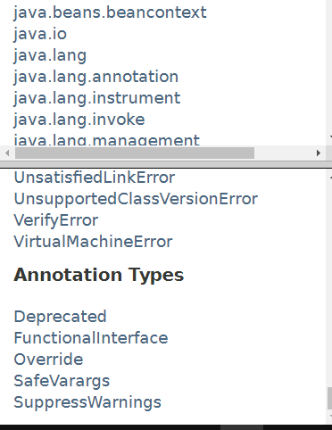
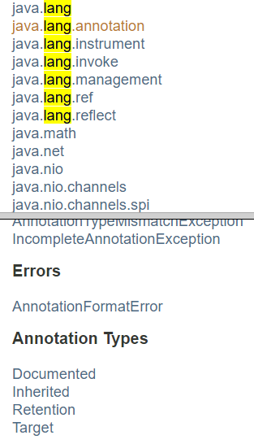

# Annotation

## 개요

- Annotation : 주석. 자바의 문법 중 하나
- 인터페이스와 같은 기능을 하지만, 표현이 간단하고 런타임시 주입이 가능하도록 설계
- java.lang.annotation.Annotation 클래스를 자동으로 상속

<details>
<summary>사용법</summary>

```java
public @interface Annotation1 {
	int param1() default 1;
	String param2();
}

public @interface Annotation2 {
	int param1() default 1;
    String value() default "2";
}

public @interface Annotation3 {
	int param1() default 1;
}

public class AnnotationTest {
	@Annotation1(param2="") // 기본 표현
    @Annotation2("3") // 이름이 value이면 묵시적 표현 가능
    @Annotation3 // 멤버가 모두 default면 생략 가능
	static void method1() {
	}
}
```
</details>

<br>

## Java Annotation

- 자바 기본 어노테이션
- java.lang에 선언되어 있어 따로 import 하지 않아도 됨

<details>
<summary>java.lang</summary>

</details>

</br>

<details>
<summary>@Deprecated : 앞으로 사용되지 않을 때 명시적으로 붙여줌</summary>

```java
@Documented
@Retention(RetentionPolicy.RUNTIME)
@Target(value={CONSTRUCTOR, FIELD, LOCAL_VARIABLE, METHOD, PACKAGE, PARAMETER, TYPE})
public @interface Deprecated {
}
```

</details>

<details>
<summary>@FunctionalInterface : 함수형 인터페이스로 만들어줌</summary>

- 함수형 인터페이스 : 리턴 값을 함수로 만들어 람다식을 변수에 할당시켜줌(js의 콜백같은 개념)

```java

@Documented
@Retention(RetentionPolicy.RUNTIME)
@Target(ElementType.TYPE)
public @interface FunctionalInterface {}
```

</details>

<details>
<summary>@Override : 오버라이드, 생략가능</summary>

```java
@Target(ElementType.METHOD)
@Retention(RetentionPolicy.SOURCE)
public @interface Override {
}
```
</details>

<details>
<summary>@SupressWarning : 경고를 없앰</summary>

```java
@Target({TYPE, FIELD, METHOD, PARAMETER, CONSTRUCTOR, LOCAL_VARIABLE})
@Retention(RetentionPolicy.SOURCE)
public @interface SuppressWarnings {
    String[] value();
}
```

</details>

<details>
<summary>@SafeVarargs : 가변 인자 경고 없앰</summary>

```java
@Documented
@Retention(RetentionPolicy.RUNTIME)
@Target({ElementType.CONSTRUCTOR, ElementType.METHOD})
public @interface SafeVarargs {}
```

</details>

<br>

## Meta Annotation

- 어노테이션을 설명하기 위한 어노테이션
- java.lang.annotation을 import하여 사용
- @Target(ElementType.ANNOTATION_TYPE)

<details>
<summary>java.lang.annotation</summary>

</details>

</br>

<details>
<summary>@Documented : 해당 어노테이션을 Javadoc에 포함시킴</summary>

```java
@Documented
@Retention(RetentionPolicy.RUNTIME)
@Target(ElementType.ANNOTATION_TYPE)
public @interface Documented {
}
```

</details>

<details>
<summary>@Inherited : 어노테이션의 상속을 가능하게 함</summary>

```java
@Documented
@Retention(RetentionPolicy.RUNTIME)
@Target(ElementType.ANNOTATION_TYPE)
public @interface Inherited {
}
```

</details>

<details>
<summary>@Native : 네이티브 메서드에 의해 참조되는 상수 필드. 네이티브 메서드는 OS별 JVM 메서드를 말함</summary>

```java
@Documented
 @Target(value=FIELD)
 @Retention(value=SOURCE)
public @interface Native
```
</details>

<details>
<summary>@Repeatable : 연속적으로 어노테이션을 선언할 수 있게 함</summary>

```java
@Documented
@Retention(RetentionPolicy.RUNTIME)
@Target(ElementType.ANNOTATION_TYPE)
public @interface Repeatable {
    Class<? extends Annotation> value();
}
```

</details>

<details>
<summary>@Retention : 어노테이션이 얼마나 유지될지 범위를 지정</summary>

```java
// @Retention(RetentionPolicy.{SOURCE|CLASS|RUNTIME})

// @Retention(RetentionPolicy.SOURCE) // 소스코드 전용
// @Retention(RetentionPolicy.CLASS) // 컴파일시까지 남아있음. 디폴트
// @Retention(RetentionPolicy.RUNTIME) // 런타임시까지 남아있음
public @interface Annotation1 {
	int param1() default 1;
    String value() default "2";
}
```
</details>

<details>
<summary>@Target : 어노테이션을 어떤 요소에 적용할지 지정</summary>

```java
// @Target({ ElementType.{TYPE|FIELD|METHOD|PARAMETER|CONSTRUCTOR|LOCAL_VARIABLE|ANNOTATION_TYPE} , ... })

// @Target(ElementType.TYPE) // value가 메서드속성이기 때문에 TYPE이 아님
@Target(ElementType.METHOD) // 하나일 때 중괄호 생략가능
public @interface Annotation1 {
	int param1() default 1;
    String value() default "2";
}

public class AnnotationTest {
    @Annotation1("3") // target이 type을 가리켰다면 오류
	static void method1() {
	}
}
```

</details>
