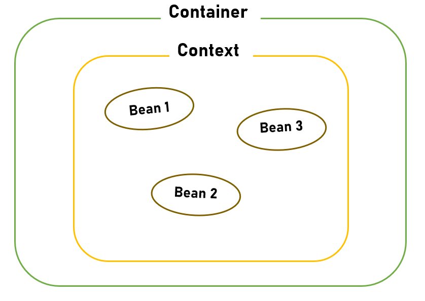
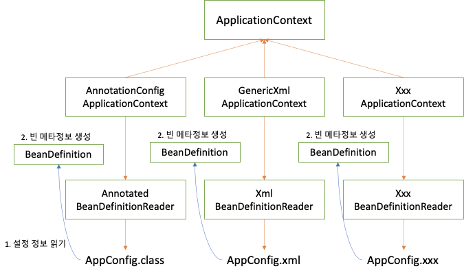

# 스프링 Container & Bean

# 컨테이너

스프링 프레임워크는 스프링의 객체를 생성하고 관리하는 컨테이너를 가지고 있다. 

- 라이프사이클 관리
- Dependency 객체 제공
- Thread 관리
- 기타 애플리케이션 실행에 필요한 환경

## IoC(Inversion of Control)

프로그램의 흐름을 컨테이너가 관리객체 간의 결합도를 떨어뜨릴 수 있다.

결합도가 높으면 해당 클래스를 유지보수할 때 결합된 다른 클래스도 같이 유지보수 해야할 가능성이 높음

```java
class User {
   private String name;
   private String Team team;
}

class Team {
   private name;
}

public static void main(String[] args) {
    User user = new User();
    Team team = new Team();
}
```

```java
@Bean
class User {
   private String name;
   private String Team team;

   public setTeam(Team team) {
      this.team = team;
}
@Bean
class Team {
   private name;
}
public static void main(String[] args) {

}
```

## DI(Dependency Injection)

```java
class User {
   private String name
   private Team team;
   
   public void setTeam(Team team) {
      this.team = team;
   }
}

public static void main(String[] args) {
   User user = new User();
   Team team = new Team();
   
   // 의존성 주입
   user.setTeam(team);
}
```

```java
@Bean
class User {
   @Autowired
   private Team team;
   
   public void setTeam(Team team) {
      this.team = team;
   }
}

public static void main(String[] args) {
   /* Setter 메소드 안써도 됨
}
```

## 컨테이너 종류

### beanFactory

bean을 등록, 생성, 조회, 반환 관리

### ApplicationContext

spring의 각종 부가 서비스를 추가로 제공

# Bean

bean 은 spring IoC container가 관리하는 자바 객체, spring bean container에 존재하는 객체를 말한다.

스프링 컨테이너에 의해 인스턴스화, 관리, 생성된다.

spring에서 빈은 singleton으로 존재한다. (자바 static 기반의 singleton 과는 차이점이 있다. [https://enterkey.tistory.com/300](https://enterkey.tistory.com/300))

## Beans xml 작성법

### Bean 생성

```java
Team teamA = new Team();

<bean id ="teamA" class="Team"/>
```

### 속성 정의

```java
teamA.setName("젠지");

<bean id ="teamA" class="Team">
	<property name ="name" value="젠지"/>
</bean>
```

### DI 정의

```java
user.setTeam(teamA);

<bean id="teamA" class="Team"/>
<bean id ="user" class="User">
	//ref에 Bean의 id 사용
	<property name ="team" ref="teamA"/>
</bean>
```

### 생성자

```java
Team teamA = new Team();
User user =new User(1, "개발자", teamA);

<bean id="teamA" class="Team"/>

<bean id="user" class="User">
   <constructor-arg>
      <value="1"/>
      <value="개발자"/>
      <ref="teamA"/>
</bean>
```

# Context

Bean의 확장 버전으로 Bean을 포함하여 여러 기능을 추가한 공간이다.



### 1. 공통 부분(ROOT-Context)

: 모든 서블릿이 **공유할 수 있는 Bean들이 모인 공간**을 말한다.DB와 관련된 **Repository나, Service 등**이 있다.

### 2. 개별 부분(Servlet-Context)

: **서블릿 각자의 Bean들이 모인 공간**이다.**웹 앱마다 한개씩 존재**하므로, **웹 앱 그 자체를 의미**하기도 한다.이 컨텍스트 내의 Bean들은 **서로 공유될 수 없다.MVC의 Controller(서블릿)이 이에 해당**한다.

# ApplicationContext

스프링 context 기능의 최상위 인터페이스


```java
package org.springframework.context;

import org.springframework.beans.factory.HierarchicalBeanFactory;
import org.springframework.beans.factory.ListableBeanFactory;
import org.springframework.beans.factory.config.AutowireCapableBeanFactory;
import org.springframework.core.env.EnvironmentCapable;
import org.springframework.core.io.support.ResourcePatternResolver;

public interface ApplicationContext extends EnvironmentCapable, ListableBeanFactory, HierarchicalBeanFactory,
		MessageSource, ApplicationEventPublisher, ResourcePatternResolver {

	String getId();

	String getDisplayName();

	long getStartupDate();

	ApplicationContext getParent();

	AutowireCapableBeanFactory getAutowireCapableBeanFactory() throws IllegalStateException;

}
```

**MessageSource**

메세지 소스를 활용한 국제화기능
즉, 국가별로 그 나라에 맞는 언어로 나오도록 하는 기능

**EnvironmentCapable**

로컬, 개발, 운영등을 구분해서 처리할 수 있게 하는 기능

**ApplicationEventPublisher**

이벤트를 발행하고 구독하는 모델을 편리하게 지원하는 기능

**ResourceLoader**

파일 클래스패스, 외부 등에서 리소스를 편리하게 조회하게 지원하는 기능

### 1. AbstractApplicationContext

ApplicationContext를 구현한 추상 클래스

```java
package org.springframework.context.support;

public abstract class AbstractApplicationContext extends DefaultResourceLoader
		implements ConfigurableApplicationContext, DisposableBean {

	public void refresh() throws BeansException, IllegalStateException {
		synchronized (this.startupShutdownMonitor) {
			// context초기화와 BeanFactory 설정
			prepareRefresh();
			ConfigurableListableBeanFactory beanFactory = obtainFreshBeanFactory();
			prepareBeanFactory(beanFactory);

			try {
				//Bean 등록전 BeanFactory 설정 변경 
				postProcessBeanFactory(beanFactory);

				// BeanFactory의 후처리
				// Bean의 정의 등록은 했지만 Bean이 초기화 되기 전의 작업 
				invokeBeanFactoryPostProcessors(beanFactory);

				// 가장 먼저 처리해야할 Bean 등록 처리
				//@Autowired 진행
				registerBeanPostProcessors(beanFactory);

				// Initialize message source for this context.
				initMessageSource();

				// Initialize event multicaster for this context.
				initApplicationEventMulticaster();

				//특수 Bean 등록
				onRefresh();

				// Check for listener beans and register them.
				registerListeners();

				//남은 singleton 등록
				finishBeanFactoryInitialization(beanFactory);

				// Last step: publish corresponding event.
				finishRefresh();
			}

			catch (BeansException ex) {
				// Destroy already created singletons to avoid dangling resources.
				destroyBeans();

				// Reset 'active' flag.
				cancelRefresh(ex);

				// Propagate exception to caller.
				throw ex;
			}
		}
	}
}
```

### 2. GenericApplicationContext

Context로서의 기능을 거의 다 갖고있다.

주로 수동으로 직접 Bean을 등록할 때 사용한다.

XmlBeanDefinitionReader를 사용하여 xml 파일을 읽어와야 한다.

```java
// Context 생성
GenericApplicationContext context = new GenericApplicationContext();

// xml 파일을 불러옴
XmlBeanDefinitionReader xmlReader = new XmlBeanDefinitionReader(context);
xmlReader.loadBeanDefinitions(new ClassPathResource("test.xml"));

// properties 파일을 불러옴
PropertiesBeanDefinitionReader propReader = new PropertiesBeanDefinitionReader(context);
propReader.loadBeanDefinitions(new ClassPathResource("testBean.properties"));

// context 초기화
context.refresh();
```

### 3. GenericXmlApplicationContext

 xml 파일을 읽어오는 과정이 내부에 있으며, 다양한 루트로 설정 파일을 불러올 수 있다.

```
ApplicationContext context = new GenericXmlApplicationContext("springtest/User/test.xml");
TestBean testBean = context.getBean("testBean");
```

---

### 4. ClassPathXmlApplicationContext

클래스 경로로 실행

```
// TestBean 클래스의 패키지 경로에 있는 test.xml을 불러온다는 뜻
ApplicationContext context = new ClassPathXmlApplicationContext("test.xml", TestBean.class);
```

훨씬 단축된 길이로 불러올 수 있다.

### 5. FileSystemXmlApplicationContext

실제 파일 경로로 실행

```
// TestBean 클래스의 패키지 경로에 있는 test.xml을 불러온다는 뜻
ApplicationContext context = new ClassPathXmlApplicationContext("/src/main/webapp/WEB-INF/springtest/User/test.xml");
```

# BeanDefinition

java, XML, Groovy 등 다양한 방식의 설정 형식을 지원



## ApplicationContext 등록 과정

1.context 생성

- root와 servlet 모두 WebApplicationContext 인터페이스 계열을 생성
- AnnotationConfigWebApplicationContext, XmlWebApplicationContext

2.Bean 정의 등록

- ROOT는 ContextLoaderListener에 의해 로딩
- Servlet은 FrameworkServlet에 의해 로딩

3.Refresh() 실행(Bean 등록)

```java
package org.springframework.web.context;

public class ContextLoader {

	//ConfigurableWebApplicationContext로 바꾼 후 WebContext를 설정 후 로딩
	public WebApplicationContext initWebApplicationContext(ServletContext servletContext) {
		if (servletContext.getAttribute(WebApplicationContext.ROOT_WEB_APPLICATION_CONTEXT_ATTRIBUTE) != null) {
			throw new IllegalStateException(
					"Cannot initialize context because there is already a root application context present - " +
					"check whether you have multiple ContextLoader* definitions in your web.xml!");
		}
		try {
			// Store context in local instance variable, to guarantee that
			// it is available on ServletContext shutdown.
			if (this.context == null) {
				this.context = createWebApplicationContext(servletContext);
			}
			if (this.context instanceof ConfigurableWebApplicationContext) {
				configureAndRefreshWebApplicationContext((ConfigurableWebApplicationContext)this.context, servletContext);
			}
			servletContext.setAttribute(WebApplicationContext.ROOT_WEB_APPLICATION_CONTEXT_ATTRIBUTE, this.context);

			ClassLoader ccl = Thread.currentThread().getContextClassLoader();
			if (ccl == ContextLoader.class.getClassLoader()) {
				currentContext = this.context;
			}
			else if (ccl != null) {
				currentContextPerThread.put(ccl, this.context);
			}
			return this.context;
		}
	}

	protected void configureAndRefreshWebApplicationContext(ConfigurableWebApplicationContext wac, ServletContext sc) {
		if (ObjectUtils.identityToString(wac).equals(wac.getId())) {
			//web.xml의 context 파라미터를 가져와서 로딩
			String idParam = sc.getInitParameter(CONTEXT_ID_PARAM);
			if (idParam != null) {
				wac.setId(idParam);
			}
			else {
				// Generate default id...
				if (sc.getMajorVersion() == 2 && sc.getMinorVersion() < 5) {
					// Servlet <= 2.4: resort to name specified in web.xml, if any.
					wac.setId(ConfigurableWebApplicationContext.APPLICATION_CONTEXT_ID_PREFIX +
							ObjectUtils.getDisplayString(sc.getServletContextName()));
				}
				else {
					wac.setId(ConfigurableWebApplicationContext.APPLICATION_CONTEXT_ID_PREFIX +
							ObjectUtils.getDisplayString(sc.getContextPath()));
				}
			}
		}

		// Determine parent for root web application context, if any.
		ApplicationContext parent = loadParentContext(sc);

		wac.setParent(parent);
		wac.setServletContext(sc);
		String initParameter = sc.getInitParameter(CONFIG_LOCATION_PARAM);
		if (initParameter != null) {
			wac.setConfigLocation(initParameter);
		}
		customizeContext(sc, wac);
		wac.refresh();
	}
}
```

