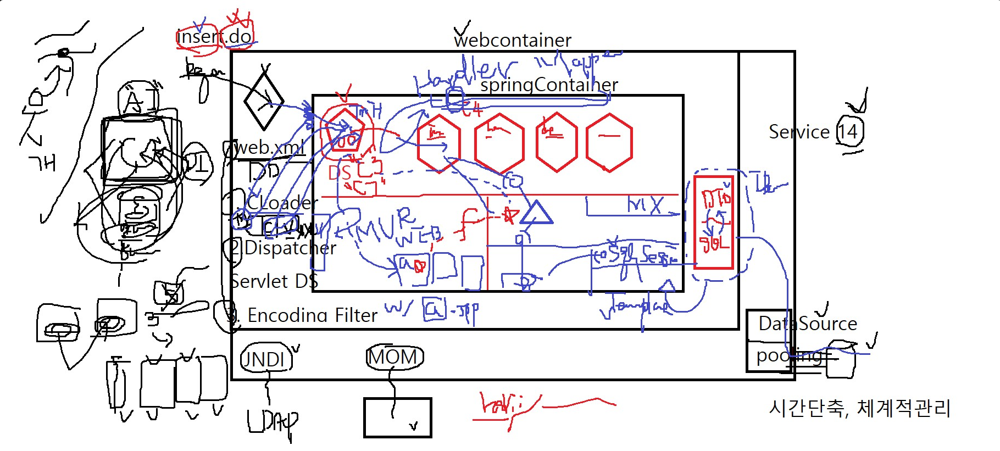

# 스프링 DispatcherServlet

## 교수님이 알려준 스프링 웹의 흐름

---



## 간단한 스프링 웹의 흐름

---


# DispatcherServlet

---

```java
package org.springframework.web.servlet;

@SuppressWarnings("serial")
public class DispatcherServlet extends FrameworkServlet {
	...
	@Override
	protected void onRefresh(ApplicationContext context) {
		initStrategies(context);
	}

	protected void initStrategies(ApplicationContext context) {
		initMultipartResolver(context);
		initLocaleResolver(context);
		initThemeResolver(context);
		initHandlerMappings(context);
		initHandlerAdapters(context);
		initHandlerExceptionResolvers(context);
		initRequestToViewNameTranslator(context);
		initViewResolvers(context);
		initFlashMapManager(context);
	}

	@Override
	protected void doService(HttpServletRequest request, HttpServletResponse response) throws Exception {
		// Keep a snapshot of the request attributes in case of an include,
		// to be able to restore the original attributes after the include.
		Map<String, Object> attributesSnapshot = null;
		if (WebUtils.isIncludeRequest(request)) {
			logger.debug("Taking snapshot of request attributes before include");
			attributesSnapshot = new HashMap<String, Object>();
			Enumeration<?> attrNames = request.getAttributeNames();
			while (attrNames.hasMoreElements()) {
				String attrName = (String) attrNames.nextElement();
				if (this.cleanupAfterInclude || attrName.startsWith("org.springframework.web.servlet")) {
					attributesSnapshot.put(attrName, request.getAttribute(attrName));
				}
			}
		}

		// Make framework objects available to handlers and view objects.
		request.setAttribute(WEB_APPLICATION_CONTEXT_ATTRIBUTE, getWebApplicationContext());
		request.setAttribute(LOCALE_RESOLVER_ATTRIBUTE, this.localeResolver);
		request.setAttribute(THEME_RESOLVER_ATTRIBUTE, this.themeResolver);
		request.setAttribute(THEME_SOURCE_ATTRIBUTE, getThemeSource());

		FlashMap inputFlashMap = this.flashMapManager.retrieveAndUpdate(request, response);
		if (inputFlashMap != null) {
			request.setAttribute(INPUT_FLASH_MAP_ATTRIBUTE, Collections.unmodifiableMap(inputFlashMap));
		}
		request.setAttribute(OUTPUT_FLASH_MAP_ATTRIBUTE, new FlashMap());
		request.setAttribute(FLASH_MAP_MANAGER_ATTRIBUTE, this.flashMapManager);

		try {
			doDispatch(request, response);
		}
		finally {
			// Restore the original attribute snapshot, in case of an include.
			if (attributesSnapshot != null) {
				restoreAttributesAfterInclude(request, attributesSnapshot);
			}
		}
	}

	protected void doDispatch(HttpServletRequest request, HttpServletResponse response) throws Exception {
		HttpServletRequest processedRequest = request;
		HandlerExecutionChain mappedHandler = null;
		int interceptorIndex = -1;

		try {
			ModelAndView mv;
			boolean errorView = false;

			try {
				processedRequest = checkMultipart(request);

				// Determine handler for the current request.
				mappedHandler = getHandler(processedRequest, false);
				if (mappedHandler == null || mappedHandler.getHandler() == null) {
					noHandlerFound(processedRequest, response);
					return;
				}

				// Determine handler adapter for the current request.
				HandlerAdapter ha = getHandlerAdapter(mappedHandler.getHandler());

                // Process last-modified header, if supported by the handler.
				String method = request.getMethod();
				boolean isGet = "GET".equals(method);
				if (isGet || "HEAD".equals(method)) {
					long lastModified = ha.getLastModified(request, mappedHandler.getHandler());
					if (logger.isDebugEnabled()) {
						String requestUri = urlPathHelper.getRequestUri(request);
						logger.debug("Last-Modified value for [" + requestUri + "] is: " + lastModified);
					}
					if (new ServletWebRequest(request, response).checkNotModified(lastModified) && isGet) {
						return;
					}
				}

				// Apply preHandle methods of registered interceptors.
				HandlerInterceptor[] interceptors = mappedHandler.getInterceptors();
				if (interceptors != null) {
					for (int i = 0; i < interceptors.length; i++) {
						HandlerInterceptor interceptor = interceptors[i];
						if (!interceptor.preHandle(processedRequest, response, mappedHandler.getHandler())) {
							triggerAfterCompletion(mappedHandler, interceptorIndex, processedRequest, response, null);
							return;
						}
						interceptorIndex = i;
					}
				}

				// Actually invoke the handler.
				mv = ha.handle(processedRequest, response, mappedHandler.getHandler());

				// Do we need view name translation?
				if (mv != null && !mv.hasView()) {
					mv.setViewName(getDefaultViewName(request));
				}

				// Apply postHandle methods of registered interceptors.
				if (interceptors != null) {
					for (int i = interceptors.length - 1; i >= 0; i--) {
						HandlerInterceptor interceptor = interceptors[i];
						interceptor.postHandle(processedRequest, response, mappedHandler.getHandler(), mv);
					}
				}
			}
			catch (ModelAndViewDefiningException ex) {
				logger.debug("ModelAndViewDefiningException encountered", ex);
				mv = ex.getModelAndView();
			}
			catch (Exception ex) {
				Object handler = (mappedHandler != null ? mappedHandler.getHandler() : null);
				mv = processHandlerException(processedRequest, response, handler, ex);
				errorView = (mv != null);
			}

			// Did the handler return a view to render?
			if (mv != null && !mv.wasCleared()) {
				render(mv, processedRequest, response);
				if (errorView) {
					WebUtils.clearErrorRequestAttributes(request);
				}
			}
			else {
				if (logger.isDebugEnabled()) {
					logger.debug("Null ModelAndView returned to DispatcherServlet with name '" + getServletName() +
							"': assuming HandlerAdapter completed request handling");
				}
			}

			// Trigger after-completion for successful outcome.
			triggerAfterCompletion(mappedHandler, interceptorIndex, processedRequest, response, null);
		}

		catch (Exception ex) {
			// Trigger after-completion for thrown exception.
			triggerAfterCompletion(mappedHandler, interceptorIndex, processedRequest, response, ex);
			throw ex;
		}
		catch (Error err) {
			ServletException ex = new NestedServletException("Handler processing failed", err);
			// Trigger after-completion for thrown exception.
			triggerAfterCompletion(mappedHandler, interceptorIndex, processedRequest, response, ex);
			throw ex;
		}

		finally {
			// Clean up any resources used by a multipart request.
			if (processedRequest != request) {
				cleanupMultipart(processedRequest);
			}
		}
	}

	protected void render(ModelAndView mv, HttpServletRequest request, HttpServletResponse response) throws Exception {
		// Determine locale for request and apply it to the response.
		Locale locale = this.localeResolver.resolveLocale(request);
		response.setLocale(locale);

		View view;
		if (mv.isReference()) {
			// We need to resolve the view name.
			view = resolveViewName(mv.getViewName(), mv.getModelInternal(), locale, request);
			if (view == null) {
				throw new ServletException(
						"Could not resolve view with name '" + mv.getViewName() + "' in servlet with name '" +
								getServletName() + "'");
			}
		}
		else {
			// No need to lookup: the ModelAndView object contains the actual View object.
			view = mv.getView();
			if (view == null) {
				throw new ServletException("ModelAndView [" + mv + "] neither contains a view name nor a " +
						"View object in servlet with name '" + getServletName() + "'");
			}
		}

		// Delegate to the View object for rendering.
		if (logger.isDebugEnabled()) {
			logger.debug("Rendering view [" + view + "] in DispatcherServlet with name '" + getServletName() + "'");
		}
		view.render(mv.getModelInternal(), request, response);
	}
```

## DispatcherServlet Class Diagram

---


## Servlet

---

```java
public interface Servlet {

    public void init(ServletConfig config) throws ServletException;

    public ServletConfig getServletConfig();

    public void service(ServletRequest req, ServletResponse res)
	throws ServletException, IOException;

    public String getServletInfo();

    public void destroy();
}
```

서블릿은 웹 클라이언트로부터 요청(Request)을 수신하고 응답(Response)한다.

## HttpServlet

---

```java
public abstract class HttpServlet extends GenericServlet
    implements java.io.Serializable
{
    private static final String METHOD_DELETE = "DELETE";
    private static final String METHOD_GET = "GET";
    private static final String METHOD_POST = "POST";
    private static final String METHOD_PUT = "PUT";

    protected void doGet(HttpServletRequest req, HttpServletResponse resp)
    {}
		protected void doPost(HttpServletRequest req, HttpServletResponse resp)
    {}
```

일반적으로 HTTP(HyperText Transfer Protocol)를 통해 송수신한다.

ServletRequest, ServletResponse를  HttpServletRequest, HttpServletResponse로 형 변환한다.

1. HTTP method를 구한다. (req.getMethod() 메소드)
2. HTTP method에 맞게 `do{method}` 메소드(doGet, doPost 등)를 호출한다.

## FrameworkServlet

---

```java
public abstract class FrameworkServlet extends HttpServletBean {

	public FrameworkServlet(WebApplicationContext webApplicationContext) {
		this.webApplicationContext = webApplicationContext;
	}

	protected WebApplicationContext initWebApplicationContext() {
		WebApplicationContext rootContext =
				WebApplicationContextUtils.getWebApplicationContext(getServletContext());
		WebApplicationContext wac = null
	}

	@Override
	protected final void doGet(HttpServletRequest request, HttpServletResponse response)
			throws ServletException, IOException {
		processRequest(request, response);
	}

	protected final void processRequest(HttpServletRequest request, HttpServletResponse response)
			throws ServletException, IOException {

		long startTime = System.currentTimeMillis();
		Throwable failureCause = null;

		LocaleContext previousLocaleContext = LocaleContextHolder.getLocaleContext();
		LocaleContextHolder.setLocaleContext(buildLocaleContext(request), this.threadContextInheritable);

		RequestAttributes previousRequestAttributes = RequestContextHolder.getRequestAttributes();
		ServletRequestAttributes requestAttributes = null;

		try {
			doService(request, response);
		}
		catch (ServletException ex) {
			failureCause = ex;
			throw ex;
		}
		catch (IOException ex) {
			failureCause = ex;
			throw ex;
		}
		catch (Throwable ex) {
			failureCause = ex;
			throw new NestedServletException("Request processing failed", ex);
		}
		finally {
			LocaleContextHolder.setLocaleContext(previousLocaleContext, this.threadContextInheritable);
			if (requestAttributes != null) {
				RequestContextHolder.setRequestAttributes(previousRequestAttributes, this.threadContextInheritable);
				requestAttributes.requestCompleted();
			}
			if (this.publishEvents) {
				// Whether or not we succeeded, publish an event.
				long processingTime = System.currentTimeMillis() - startTime;
				this.webApplicationContext.publishEvent(
						new ServletRequestHandledEvent(this,
								request.getRequestURI(), request.getRemoteAddr(),
								request.getMethod(), getServletConfig().getServletName(),
								WebUtils.getSessionId(request), getUsernameForRequest(request),
								processingTime, failureCause));
			}
		}
	}
```

Spring의 웹 프레임워크용 기본 서블릿입니다. 

JavaBean 기반 전체 솔루션에서 Spring 애플리케이션 컨텍스트와의 통합을 제공합니다.

1. 현재 HTTP request의 Locale을 구한다. (LocaleContextHolder.getLocaleContext() 메소드)
2. HTTP request의 속성(session, request, response)을 담고 있는 ServletRequestAttributes 클래스를 생성한다.
3. 현재 요청된 정보(request, locale, requuest 속성 등)를 ThreadLocal에 담는다. (initContextHolders(request, localeContext, requestAttributes) 메소드)
4. FrameworkServlet#doService 메소드를 호출한다.

## DispatcherServlet

---

1. WebApplicationContext, LocaleResolver, ThemeResolver, ThemeSource를 HTTP reuqest 속성에 담는다.
    
    `request.setAttribute(WEB_APPLICATION_CONTEXT_ATTRIBUTE, getWebApplicationContext());
    request.setAttribute(LOCALE_RESOLVER_ATTRIBUTE, this.localeResolver);
    request.setAttribute(THEME_RESOLVER_ATTRIBUTE, this.themeResolver);
    request.setAttribute(THEME_SOURCE_ATTRIBUTE, getThemeSource());`
    

```java
package org.springframework.web.servlet;

@SuppressWarnings("serial")
public class DispatcherServlet extends FrameworkServlet {

	@Override
	protected void doService(HttpServletRequest request, HttpServletResponse response) throws Exception {
		// Keep a snapshot of the request attributes in case of an include,
		// to be able to restore the original attributes after the include.
		Map<String, Object> attributesSnapshot = null;
		if (WebUtils.isIncludeRequest(request)) {
			logger.debug("Taking snapshot of request attributes before include");
			attributesSnapshot = new HashMap<String, Object>();
			Enumeration<?> attrNames = request.getAttributeNames();
			while (attrNames.hasMoreElements()) {
				String attrName = (String) attrNames.nextElement();
				if (this.cleanupAfterInclude || attrName.startsWith("org.springframework.web.servlet")) {
					attributesSnapshot.put(attrName, request.getAttribute(attrName));
				}
			}
		}

		// Make framework objects available to handlers and view objects.
		request.setAttribute(WEB_APPLICATION_CONTEXT_ATTRIBUTE, getWebApplicationContext());
		request.setAttribute(LOCALE_RESOLVER_ATTRIBUTE, this.localeResolver);
		request.setAttribute(THEME_RESOLVER_ATTRIBUTE, this.themeResolver);
		request.setAttribute(THEME_SOURCE_ATTRIBUTE, getThemeSource());

		FlashMap inputFlashMap = this.flashMapManager.retrieveAndUpdate(request, response);
		if (inputFlashMap != null) {
			request.setAttribute(INPUT_FLASH_MAP_ATTRIBUTE, Collections.unmodifiableMap(inputFlashMap));
		}
		request.setAttribute(OUTPUT_FLASH_MAP_ATTRIBUTE, new FlashMap());
		request.setAttribute(FLASH_MAP_MANAGER_ATTRIBUTE, this.flashMapManager);

		try {
			doDispatch(request, response);
		}
		finally {
			// Restore the original attribute snapshot, in case of an include.
			if (attributesSnapshot != null) {
				restoreAttributesAfterInclude(request, attributesSnapshot);
			}
		}
	}
}
```

1. HTTP 요청 log를 찍는다. (logRequest(request) 메소드)
2. attributesSnapshot에 HTTP reqeust 속성을 보관(snapshot)한다.
3. FlashMap에 속성을 저장한다. (this.flashMapManager.retrieveAndUpdate(request, response) 메소드)
    - FlashMap은 HTTP 요청, 응답 생명주기에도 살아있고, View가 렌더링 된 후에 삭제된다.
4. DispatcherServlet#doDispatch(request, response) 메소드 호출

```java
	protected void doDispatch(HttpServletRequest request, HttpServletResponse response) throws Exception {
		HttpServletRequest processedRequest = request;
		HandlerExecutionChain mappedHandler = null;
		int interceptorIndex = -1;

		try {
			ModelAndView mv;
			boolean errorView = false;

			try {
				processedRequest = checkMultipart(request);

				// Determine handler for the current request.
				mappedHandler = getHandler(processedRequest, false);
				if (mappedHandler == null || mappedHandler.getHandler() == null) {
					noHandlerFound(processedRequest, response);
					return;
				}

				// Determine handler adapter for the current request.
				HandlerAdapter ha = getHandlerAdapter(mappedHandler.getHandler());

                // Process last-modified header, if supported by the handler.
				String method = request.getMethod();
				boolean isGet = "GET".equals(method);
				if (isGet || "HEAD".equals(method)) {
					long lastModified = ha.getLastModified(request, mappedHandler.getHandler());
					if (logger.isDebugEnabled()) {
						String requestUri = urlPathHelper.getRequestUri(request);
						logger.debug("Last-Modified value for [" + requestUri + "] is: " + lastModified);
					}
					if (new ServletWebRequest(request, response).checkNotModified(lastModified) && isGet) {
						return;
					}
				}

				// Apply preHandle methods of registered interceptors.
				HandlerInterceptor[] interceptors = mappedHandler.getInterceptors();
				if (interceptors != null) {
					for (int i = 0; i < interceptors.length; i++) {
						HandlerInterceptor interceptor = interceptors[i];
						if (!interceptor.preHandle(processedRequest, response, mappedHandler.getHandler())) {
							triggerAfterCompletion(mappedHandler, interceptorIndex, processedRequest, response, null);
							return;
						}
						interceptorIndex = i;
					}
				}

				// Actually invoke the handler.
				mv = ha.handle(processedRequest, response, mappedHandler.getHandler());

				// Do we need view name translation?
				if (mv != null && !mv.hasView()) {
					mv.setViewName(getDefaultViewName(request));
				}

				// Apply postHandle methods of registered interceptors.
				if (interceptors != null) {
					for (int i = interceptors.length - 1; i >= 0; i--) {
						HandlerInterceptor interceptor = interceptors[i];
						interceptor.postHandle(processedRequest, response, mappedHandler.getHandler(), mv);
					}
				}
			}
			catch (ModelAndViewDefiningException ex) {
				logger.debug("ModelAndViewDefiningException encountered", ex);
				mv = ex.getModelAndView();
			}
			catch (Exception ex) {
				Object handler = (mappedHandler != null ? mappedHandler.getHandler() : null);
				mv = processHandlerException(processedRequest, response, handler, ex);
				errorView = (mv != null);
			}

			// Did the handler return a view to render?
			if (mv != null && !mv.wasCleared()) {
				render(mv, processedRequest, response);
				if (errorView) {
					WebUtils.clearErrorRequestAttributes(request);
				}
			}
			else {
				if (logger.isDebugEnabled()) {
					logger.debug("Null ModelAndView returned to DispatcherServlet with name '" + getServletName() +
							"': assuming HandlerAdapter completed request handling");
				}
			}

			// Trigger after-completion for successful outcome.
			triggerAfterCompletion(mappedHandler, interceptorIndex, processedRequest, response, null);
		}

		catch (Exception ex) {
			// Trigger after-completion for thrown exception.
			triggerAfterCompletion(mappedHandler, interceptorIndex, processedRequest, response, ex);
			throw ex;
		}
		catch (Error err) {
			ServletException ex = new NestedServletException("Handler processing failed", err);
			// Trigger after-completion for thrown exception.
			triggerAfterCompletion(mappedHandler, interceptorIndex, processedRequest, response, ex);
			throw ex;
		}

		finally {
			// Clean up any resources used by a multipart request.
			if (processedRequest != request) {
				cleanupMultipart(processedRequest);
			}
		}
	}
```

DispatcherServlet은 여러 가지 Resolver와 클래스를 이용해 요청을 처리한다. 때문에 이 글에서 모두 설명하기는 어렵고 대략적인 것만 설명할 예정이다. 자세한 설명은 다음 글에서 여러 가지 Resolver를 하나씩 살펴볼 예정이다.

1. `Multipart` 요청 인지 체크한다. (DispatcherServlet#checkMultipart(request) 메소드)
2. `HTTP 요청에 해당하는` [HandlerExecutionChain](https://docs.spring.io/spring-framework/docs/current/javadoc-api/org/springframework/web/servlet/HandlerExecutionChain.html)을 구한다. (DispatcherServlet#getHandler(processedRequest) 메소드)
    - URL을 기준으로 [HandlerMapping](https://docs.spring.io/spring-framework/docs/current/javadoc-api/org/springframework/web/servlet/HandlerMapping.html)을 찾는다.
    - HandlerExecutionChain은 HandlerMapping에 의해 생성된다.
    - HandlerExecutionChain은 Interceptor List를 포함하고 있다.
3. HandlerExecutionChain이 null이면 `HTTP Status 404를 response` 한다. (DispatcherServlet#noHandlerFound(processedRequest, response) 메소드)
    - 개발하며 자주 보게 되는 404 not found error를 이 메소드에서 실행한다.
4. Controller를 실행하기 위해 [HandlerAdapter](https://docs.spring.io/spring/docs/current/javadoc-api/org/springframework/web/servlet/HandlerAdapter.html)를 구한다.(DispatcherServlet#getHandlerAdapter(mappedHandler.getHandler()) 메소드)
    - HandlerAdapter는 우리가 작성한 Controller를 실행하는 역할을 한다.
    - HandlerMapping은 URL을 기준으로 어떤 Handler로 매핑할지 결정한다면, HandlerAdapter는 결정된 Handler를 실행한다.
5. [HandlerInterceptor](https://docs.spring.io/spring-framework/docs/current/javadoc-api/org/springframework/web/servlet/HandlerInterceptor.html)로 전처리(Interceptor#preHandle)를 실행한다. (mappedHandler.applyPreHandle(processedRequest, response) 메소드)
6. HandlerAdapter#handle 메소드를 호출해 실제 로직(Controller)을 실행한 후 [ModelAndView](https://docs.spring.io/spring-framework/docs/current/javadoc-api/org/springframework/web/servlet/ModelAndView.html)를 생성한다. (mv = ha.handle(processedRequest, response, mappedHandler.getHandler()) 메소드)
7. Interceptor로 후처리(Interceptor#postHandle)를 실행한다. (mappedHandler.applyPostHandle(processedRequest, response, mv) 메소드)
8. View를 렌더링 하거나, Exception을 핸들링한다. (processDispatchResult(processedRequest, response, mappedHandler, mv, dispatchException) 메소드)
    - View 렌더링은 [ViewResolver](https://docs.spring.io/spring-framework/docs/current/javadoc-api/org/springframework/web/servlet/ViewResolver.html)가 담당한다.
    - Exception 핸들링은 [HandlerExceptionResolver](https://docs.spring.io/spring/docs/current/javadoc-api/org/springframework/web/servlet/HandlerExceptionResolver.html)가 담당한다.

### **DispatcherServlet#doDispatcher에서 알아야 할 것.**

1. Multipart (파일 업로드)를 처리하는 MultipartResolver
2. Controller 실행에 필요한 HandlerMapping, HandlerAdapter 그리고 ModelAndView
3. View 렌더링 또는 Exception 핸들링에 필요한 ViewResolver와 HandlerExceptionResolver


	

## 그래서 DispatcherServlet에서 왜 초기화하는데?

```java
	protected void initStrategies(ApplicationContext context) {
		initMultipartResolver(context);
		initLocaleResolver(context);
		initThemeResolver(context);
		initHandlerMappings(context);
		initHandlerAdapters(context);
		initHandlerExceptionResolvers(context);
		initRequestToViewNameTranslator(context);
		initViewResolvers(context);
		initFlashMapManager(context);
	}
```

### MultipartResolver

- 인코딩 타입이 Multipart인 경우 파라미터나 업로드한 파일을 전송 데이터에 알맞게 처리

### LocaleResolver

- 다국어 처리를 위해 Spring MVC는 LocaleResolver를 이용하여 웹 요청과 관련해서 Locale을 추출하고 이 Locale 객체를 이용해서 알맞은 언어의 메시지를 선택

```java
@Controller
public class HomeController {	
	private static final Logger logger = LoggerFactory.getLogger(HomeController.class);

	@RequestMapping(value = "/", method = RequestMethod.GET)
	public String home(Locale locale, Model model) {
		logger.info("Welcome home! The client locale is {}.", locale);
		
		Date date = new Date();
		DateFormat dateFormat = DateFormat.getDateTimeInstance(DateFormat.LONG, DateFormat.LONG, locale);
		
		String formattedDate = dateFormat.format(date);
		
		model.addAttribute("serverTime", formattedDate );
		
		return "home";
	}	
}
```

### ThemeResolver

- 애플리케이션에 설정된 테마를 파악하고 변경할 수 있는 인터페이스
- Theme이라는 Key 값을 뷰에 전달하고 뷰가 Key 값에 해당하는 적절한 리소스(ex) css) 읽어와 테마를 그에 맞게 렌더링함

### HandlerMapping

- 요청을 처리할 핸들러를 찾는 인터페이스
- ~~HandlerExecutionChain 설명 필요~~

### HandlerAdapter

- HandlerMapping이 찾아낸 “핸들러”를 처리하는 인터페이스
- 스프링 MVC 확장력의 핵심

### HandlerExceptionResolver

- 요청 처리 중에 발생한 에러 처리하는 인터페이스

### RequestToViewNameTranslator

- 핸들러에서 뷰 이름을 명시적으로 리턴하지 않은 경우, 요청을 기반으로 뷰 이름을 판단하는 인터페이스

```java
@Controller
public class HomeController {	
	private static final Logger logger = LoggerFactory.getLogger(HomeController.class);

	@RequestMapping(value = "/home", method = RequestMethod.GET)
	public String home(Locale locale, Model model) {
		logger.info("Welcome home! The client locale is {}.", locale);
		
		Date date = new Date();
		DateFormat dateFormat = DateFormat.getDateTimeInstance(DateFormat.LONG, DateFormat.LONG, locale);
		
		String formattedDate = dateFormat.format(date);
		
		model.addAttribute("serverTime", formattedDate );
		
	}	
}
```

### ViewResolvers

- • 뷰 이름(string)에 해당하는 뷰를 찾아내는 인터페이스

### FlashMapManager

- FlashMap 인스턴스를 가져오고 저장하는 인터페이스
- FlashMap은 주로 리다이렉션을 사용할 때 요청 매개변수를 사용하지 않고 데이터를 전달하고 정리할 때 사용한다.
- redirect:/events
- ~~FlashMap 보충설명 필요~~

### DispatcherServlet의 흐름

정상처리의 경우

MultipartResolve -> getHandler(Mapping) -> getAdapter -> HandlerExecutionChain(PreInterceptor -> Handle(+returnValue) -> ViewName -> PostInterceptor) -> Render(LocalResolver, resolveViewName, view.render())

에러처리의 경우

MultipartResolve -> getHandler(Mapping) -> getAdapter -> HandlerExecutionChain(PreInterceptor -> Handle(+returnValue) -> ViewName -> PostInterceptor) -> HandlerException -> Render(LocalResolver, resolveViewName, view.render())

각종 에러, 정상처리 등의 완료작업에는 Interceptor.Complete가 수행된다

---

# 정리

1. DispatcherServlet은 ApplicationContextAware를 구현한 클래스로써 ApplicationContext에대해 접근할 수 있다
2. ApplicationContext의 등록된 FactoryBean을 통해 다양한 Resolver Bean을 불러와 저장한다
3. DispatcherServlet또한 SingletoneBean으로 ApplicationContext가 Initailizer될 때 생성된다
4. Dispatcher에 대한 정확한 방법을 알 수 있었다

### 장점

- @Controller 어노테이션 - 어노테이션으로 컨트롤러를 만들고 핸들러 매핑으로 서블릿을 일일이 만들 필요가 없어졌다.
- 모든 주소의 공통적인 전처리, 후처리 작업을 할 수 있다.

****ServletContainerInitializer or web.xml → ContextLoader를 통해 WebApplicationContext를 생성 및 초기화****