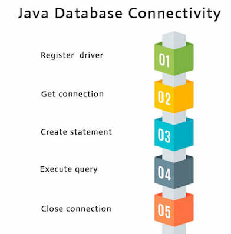

# CS01/09(Mybatis)

# **Mybatis?**

---


편하긴 하지만 단점이 존재하여 JPA와 같이 쓰면 좋습니다.

~~객체 지향 언어인 자바의 관계형 데이터베이스 프로그래밍을 좀 더 쉽게 할 수 있게 도와 주는 개발 프레임 워크로서 JDBC를 통해 데이터베이스에 엑세스하는 작업을 캡슐화하고 일반 SQL 쿼리, 저장 프로 시저 및 고급 매핑을 지원하며 모든 JDBC 코드 및 매개 변수의 중복작업을 제거 합니다.~~

→ **Mybatis는 스프링에서 데이터베이스 연동을 도와주는 프레임워크입니다.**

**기존 JDBC**

---



- 기존의 방식엔 소스코드 부분에 SQL문이 들어가며 드라이버 등록부터 연결 해제까지 복잡한 과정이 하나의 DAO에 다 있었습니다.

```java
package com.ssafy.board.model.dao;

@Repository
public class BoardDaoImpl implements BoardDao {

	private final DataSource dataSource;
	private final DBUtil dbUtil;
	
	@Autowired
	public BoardDaoImpl(DataSource dataSource, DBUtil dbUtil) {
		this.dataSource = dataSource;
		this.dbUtil = dbUtil;
	}
	
	@Override
	public int writeArticle(BoardDto boardDto) throws SQLException {
		int cnt = 0;
		Connection conn = null;
		PreparedStatement pstmt = null;
		try {
			conn = dataSource.getConnection();
			StringBuilder sql = new StringBuilder();
			sql.append("insert into board (user_id, subject, content, hit, register_time) \n");
			sql.append("values (?, ?, ?, 0, now())");
			pstmt = conn.prepareStatement(sql.toString());
			pstmt.setString(1, boardDto.getUserId());
			pstmt.setString(2, boardDto.getSubject());
			pstmt.setString(3, boardDto.getContent());
			cnt = pstmt.executeUpdate();
		} finally {
			dbUtil.close(pstmt, conn);
		}
		return cnt;
	}
```

```xml
<?xml version="1.0" encoding="UTF-8"?>
<Context>
	<Resource name="jdbc/ssafy" auth="Container" type="javax.sql.DataSource" 
			maxTotal="100" maxIdle="30" maxWaitMillis="10000" 
			username="ssafy" password="ssafy" driverClassName="com.mysql.cj.jdbc.Driver" 	
			url="jdbc:mysql://localhost:3306/ssafyweb?serverTimezone=UTC&amp;useUniCode=yes&amp;characterEncoding=UTF-8"/> 
    <WatchedResource>WEB-INF/web.xml</WatchedResource>
</Context>
```

- 하나의 소스코드 안에 연결 - sql분 - 해제 등이 모두 들어가 있는 것을 알 수 있습니다.
- iBatis도 역시 sqlSession객체를 가져오고 사용하는 코드를 개발자가 직접 써야했습니다.

## **Mybatis**

---

**Mybatis 주요 구성 요소**

---

| 구성 요소 | 설명 |
| --- | --- |
| configuration file (XML) | Mybatis 작업 설정을 설명하는 XML파일.
데이터베이스의 연결 대상, 매핑 파일의 경로, 작업 설정 등 세부 사항을 설명하는 파일입니다. 스프링과 통합하여 사용할 때 DB연결 대상과 매핑 파일 경로 설정을 구성 파일에 지정할 필요가 없습니다. |
| org.apache.ibatis.session.SqlSessionFactoryBuilder | MyBatis3 구성 파일을 읽고 생성하는 SqlSessionFactory 구성 요소입니다.
이 구성 요소는 스프링과 통합되어 사용할 때 애플리케이션 클래스에서 직접 처리하지 않습니다. |
| org.apache.ibatis.session.SqlSessionFactory | SqlSession을 생성하는 구성 요소입니다.
이 구성 요소는 스프링과 통합되어 사용할 때 애플리케이션 클래스에서 직접 처리하지 않습니다. |
| org.apache.ibatis.session.SqlSession | SQL 실행 및 트랜잭션 제어를 위한 API를 제공하는 구성 요소입니다.
MyBatis3를 사용하여 데이터베이스에 액세스할 때 가장 중요한 역할을 하는 구성 요소입니다.
이 구성 요소를 스프링과 통합하여 사용할 경우 애플리케이션 클래스에서 직접 처리하지 않습니다. |
| Mapper interface |  typealias 에서 매핑 파일에 정의된 SQL을 호출하는 인터페이스입니다.MyBatis3는 매퍼 인터페이스에 대한 구현 클래스를 자동으로 생성하므로 개발자는 인터페이스만 생성하면 됩니다. |
| Mapping file (XML) | SQL 및 O/R 매핑 설정을 설명하는 XML 파일입니다. |

**Mapper interface**

```java
package com.ssafy.board.model.mapper;

import java.util.List;

import org.apache.ibatis.annotations.Mapper;

import com.ssafy.board.model.BoardDto;

@Mapper
public interface BoardMapper {
	void write(BoardDto board) throws Exception;
	void update(BoardDto board) throws Exception;
	void delete(int articleNo) throws Exception;
	
	void updateHit(int articleNo) throws Exception;
	
	List<BoardDto> list() throws Exception;
	BoardDto getBoard(int articleNo) throws Exception;

}
```

**Mapper file(XML)**

```xml
<?xml version="1.0" encoding="UTF-8" ?>
<!DOCTYPE mapper PUBLIC "-//mybatis.org//DTD Mapper 3.0//EN" 
	"http://mybatis.org/dtd/mybatis-3-mapper.dtd">

<mapper namespace="com.ssafy.board.model.mapper.BoardMapper">

	<resultMap type="boardDto" id="article">
		<result column="article_no" property="articleNo"/>
		<result column="user_id" property="userId"/>
		<result column="user_name" property="userName"/>
		<result column="subject" property="subject"/>
		<result column="content" property="content"/>
		<result column="hit" property="hit"/>
		<result column="register_time" property="registerTime"/>
	</resultMap>
	
	<select id="list" resultMap="article">
		select b.article_no, b.user_id,	m.user_name, b.subject,	b.content, b.hit, 
		b.register_time
		from board b, members m
		where b.user_id=m.user_id
		order by article_no
	</select>
	
	<select id="getBoard" parameterType="int" resultMap="article">
		select b.article_no, b.user_id,	m.user_name, b.subject,	b.content,
		b.hit, b.register_time
		from board b, members m
		where b.user_id=m.user_id and b.article_no=#{articleNo}
	</select>
	
	<insert id="write" parameterType="boardDto">
	insert into board(user_id,subject,content,hit,register_time) 
	values(#{userId},#{subject},#{content},0,now())
	</insert>
	
	<update id="update"  parameterType="boardDto">
	update board set subject=#{subject}, content=#{content}, register_time=now()
	where article_no=#{articleNo}
	</update>
	
	<update id="updateHit"  parameterType="int">
	update board set hit=hit+1
	where article_no=#{articleNo}
	</update>
	
	<delete id="delete"  parameterType="int">
	delete from  board 
	where article_no=#{articleNo}
	</delete>
</mapper>
```

### **Mybatis 구성 요소가 DB Access 하는 순서**

---

![출처: [[MyBatis] MyBatis란? 개념 및 데이터구조 :: 히진쓰의 서버사이드 기술 블로그 (tistory.com)](https://khj93.tistory.com/entry/MyBatis-MyBatis%EB%9E%80-%EA%B0%9C%EB%85%90-%EB%B0%8F-%ED%95%B5%EC%8B%AC-%EC%A0%95%EB%A6%AC)](img/Untitled%201.png)

출처: [[MyBatis] MyBatis란? 개념 및 데이터구조 :: 히진쓰의 서버사이드 기술 블로그 (tistory.com)](https://khj93.tistory.com/entry/MyBatis-MyBatis%EB%9E%80-%EA%B0%9C%EB%85%90-%EB%B0%8F-%ED%95%B5%EC%8B%AC-%EC%A0%95%EB%A6%AC)

(1)~(3)은 응용 프로그램 시작 시 수행되는 프로세스입니다.

| 1 | 응용 프로그램이 SqlSessionFactoryBuilder를 위해 SqlSessionFactory를 빌드하도록 요청합니다. |
| --- | --- |
| 2 | SqlSessionFactoryBuilder는 SqlSessionFactory를 생성하기 위한 MyBatis 구성 파일을 읽습니다. |
| 3 | SqlSessionFactoryBuilder는 MyBatis 구성 파일의 정의에 따라 SqlSessionFactory를 생성합니다. |

(4)~(10)은 클라이언트의 요청마다 수행되는 프로세스입니다.

| 4 | 클라이언트가 응용 프로그램에 대한 프로세스를 요청합니다. |
| --- | --- |
| 5 | 응용 프로그램은 SqlSessionFactoryBuilder를 사용하여 빌드된 SqlSessionFactory에서 SqlSession을 가져옵니다. |
| 6 | SqlSessionFactory는 SqlSession을 생성하고 이를 애플리케이션에 반환합니다. |
| 7 | 응용 프로그램이 SqlSession에서 매퍼 인터페이스의 구현 개체를 가져옵니다. |
| 8 | 응용 프로그램이 매퍼 인터페이스 메서드를 호출합니다. |
| 9 | 매퍼 인터페이스의 구현 개체가 SqlSession 메서드를 호출하고 SQL 실행을 요청합니다. |
| 10 | SqlSession은 매핑 파일에서 실행할 SQL을 가져와 SQL을 실행합니다. |

## Mybatis - Spring

---

**Mybatis-Spring의 컴포넌트 구조**

|  org.mybatis.spring.SqlSessionFactoryBean | 표준 MyBatis3에서 SqlSessionFactory는 MyBatis 구성 파일에 정의된 정보를 기반으로 합니다. 그러나 SqlSessionFactoryBean을 사용하면 MyBatis 구성 파일이 없어도 SqlSessionFactory를 빌드할 수 있습니다. |
| --- | --- |
|  org.mybatis.spring.mapper.MapperFactoryBean | MyBatis-Spring 구성 요소에 의해 생성된 매퍼 개체는 안전한 매퍼 개체를 생성할 수 있습니다. 따라서 서비스 등 싱글톤 구성요소에 DI를 적용할 수 있습니다. |
|  org.mybatis.spring.SqlSessionTemplate | MyBatis-Spring 구성 요소에서 생성된 SqlSession 개체는 안전한 스레드 SqlSession 개체를 생성할 수 있습니다. 따라서 서비스 등 싱글톤 구성요소에 DI를 적용할 수 있습니다. |

![출처: [[MyBatis] MyBatis란? 개념 및 데이터구조 :: 히진쓰의 서버사이드 기술 블로그 (tistory.com)](https://khj93.tistory.com/entry/MyBatis-MyBatis%EB%9E%80-%EA%B0%9C%EB%85%90-%EB%B0%8F-%ED%95%B5%EC%8B%AC-%EC%A0%95%EB%A6%AC)](img/Untitled%202.png)

출처: [[MyBatis] MyBatis란? 개념 및 데이터구조 :: 히진쓰의 서버사이드 기술 블로그 (tistory.com)](https://khj93.tistory.com/entry/MyBatis-MyBatis%EB%9E%80-%EA%B0%9C%EB%85%90-%EB%B0%8F-%ED%95%B5%EC%8B%AC-%EC%A0%95%EB%A6%AC)

(1)~(4)는 응용 프로그램 시작 시 수행되는 프로세스입니다.

| 1 | SqlSessionFactoryBean은 SqlSessionFactoryBuilder를 위해 SqlSessionFactory를 빌드하도록 요청합니다. |
| --- | --- |
| 2 | SessionFactoryBuilder는 SqlSessionFactory 생성을 위해 MyBatis 구성 파일을 읽습니다. |
| 3 | SqlSessionFactoryBuilder는 MyBatis 구성 파일의 정의에 따라 SqlSessionFactory를 생성합니다. 따라서 생성된 SqlSessionFactory는 Spring DI 컨테이너에 의해 저장됩니다. |
| 4 | MapperFactoryBean은 안전한 SqlSession(SqlSessionTemplate) 및 스레드 안전 매퍼 개체(Mapper 인터페이스의 프록시 객체)를 생성합니다. 따라서 생성되는 매퍼 객체는 스프링 DI 컨테이너에 의해 저장되며 서비스 클래스 등에 DI가 적용됩니다. 매퍼 개체는 안전한 SqlSession(SqlSessionTemplate)을 사용하여 스레드 안전 구현을 제공합니다. |

(5)~(11)은 클라이언트의 각 요청에 대해 수행되는 프로세스입니다.

| 5 | 클라이언트가 응용 프로그램에 대한 프로세스를 요청합니다. |
| --- | --- |
| 6 | 애플리케이션(서비스)은 DI 컨테이너에서 주입한 매퍼 개체(매퍼 인터페이스를 구현하는 프록시 개체)의 방법을 호출합니다. |
| 7 | 매퍼 객체는 호출된 메소드에 해당하는 SqlSession (SqlSessionTemplate ) 메서드를 호출합니다. |
| 8 | SqlSession (SqlSessionTemplate )은 프록시 사용 및 안전한 SqlSession 메서드를 호출합니다. |
| 9 | 프록시 사용 및 스레드 안전 SqlSession은 트랜잭션에 할당된 MyBatis3 표준 SqlSession을 사용합니다.
 트랜잭션에 할당된 SqlSession이 존재하지 않는 경우 SqlSessionFactory 메서드를 호출하여 표준 MyBatis3의 SqlSession을 가져옵니다. |
| 10 | SqlSessionFactory는 MyBatis3 표준 SqlSession을 반환합니다.
 반환된 MyBatis3 표준 SqlSession이 트랜잭션에 할당되기 때문에 동일한 트랜잭션 내에 있는 경우 새 SqlSession을 생성하지 않고 동일한 SqlSession을 사용합니다.on 메서드를 호출하고 SQL 실행을 요청합니다. |
| 11 | MyBatis3 표준 SqlSession은 매핑 파일에서 실행할 SQL을 가져와 실행합니다. |

## Mybatis + JPA

---

**Mybatis의 단점**

---

1. 스키마 변경시 SQL 쿼리를 직접 수정해주어야 합니다.
2. 반복된 쿼리가 발생하여 반복 작업이 있습니다.
3. 쿼리를 직접 작성하기 때문에 데이터베이스에 종속된 쿼리문이 발생할 수 있습니다.
4. 데이터베이스 변경 시 로직도 함께 수정해주어야 ㅎ

**JPA장점**

---

1. 쿼리를 하나하나 작성할 필요가 없어 코드량이 감소합니다.
2. 가독성이 좋습니다.
3. 간편하게 수정이 가능합니다.
4. 동일한 쿼리에 대한 캐시 기능을 사용하기 때문에 더욱 높은 성능을 낼 수 있습니다.

→ **따라서, CRUD같은 코드는 JPA로 복잡한 쿼리문은 Mybatis로 사용하면 좋을 것 같습니다.**