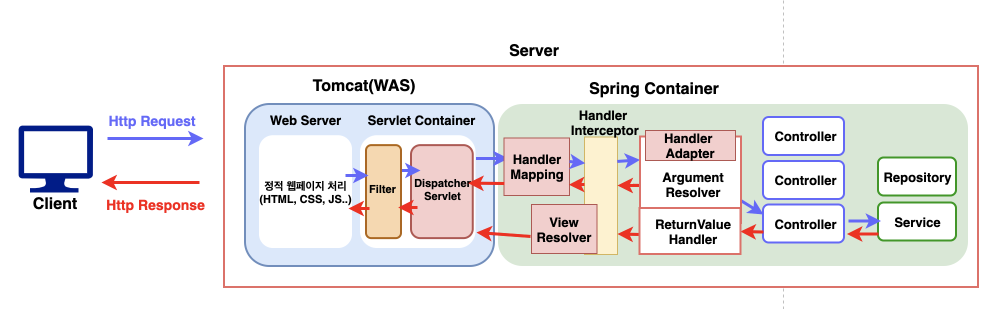
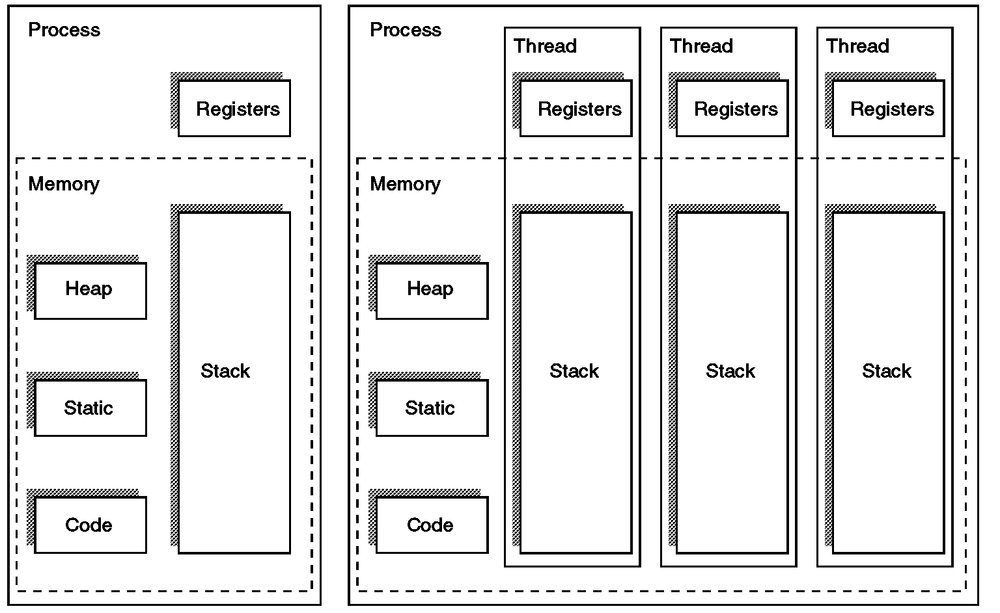

# 스프링 Thread

# Thread

## 이제는 이해할 수 있는 서버의 흐름



### but 요청이 여러 개라면???

## Thread



프로세스 - 실행중인 프로그램

쓰레드 - 프로세스의 실행 단위

      - 독립적인 함수 호출을 위해 독립적인 stack 메모리 공간을 갖고 있다.

### 요청의 갯수만큼 쓰레드를 늘리면 되겠네?

쓰레드 생성에 비용이 발생 - OS Kernel 의 작업이 필요 

요청이 들어올 때마다 쓰레드를 생성하면 오히려 요청 처리 시간이 증가

## Thread pool


1. 첫 작업이 들어오면, core size만큼의 스레드를 생성합니다.
2. 요청이 들어올 때마다 작업 큐에 담아둡니다.
3. core size의 스레드 중, 유휴상태인 스레드가 있다면 작업 큐에서 작업을 꺼내 스레드에 작업을 할당하여 작업을 처리합니다.
    
    3-1. 만약 유휴상태인 스레드가 없다면, 작업은 작업 큐에서 대기합니다.
    
    3-2. 그 상태가 지속되어 작업 큐가 꽉 찬다면, 스레드를 새로 생성합니다.
    
    3-3. 3번과정을 반복하다 스레드 최대 사이즈 에 도달하고 작업큐도 꽉 차게 되면, 추가 요청에 대해선 connection-refused 오류를 반환합니다.
    
4. 태스크가 완료되면 스레드는 다시 유휴상태로 돌아갑니다.
    
    4-1. 작업큐가 비어있고 core size이상의 스레드가 생성되어있다면 스레드를 destory합니다.
    

## ThreadPoolExecutor

```java
public class ThreadPoolTaskExecutor extends ExecutorConfigurationSupport implements SchedulingTaskExecutor {

	private final Object poolSizeMonitor = new Object();
	//동시에 실행시킬 쓰레드의 갯수 
	private int corePoolSize = 1;
	//쓰레드 풀의 최대 사이즈
	private int maxPoolSize = Integer.MAX_VALUE;

	private int keepAliveSeconds = 60;

	private boolean allowCoreThreadTimeOut = false;
	//큐의 사이즈
	private int queueCapacity = Integer.MAX_VALUE;

	private ThreadPoolExecutor threadPoolExecutor;

	protected ExecutorService initializeExecutor(
			ThreadFactory threadFactory, RejectedExecutionHandler rejectedExecutionHandler) {

		BlockingQueue<Runnable> queue = createQueue(this.queueCapacity);
		ThreadPoolExecutor executor  = new ThreadPoolExecutor(
				this.corePoolSize, this.maxPoolSize, this.keepAliveSeconds, TimeUnit.SECONDS,
				queue, threadFactory, rejectedExecutionHandler);
		if (this.allowCoreThreadTimeOut) {
			executor.allowCoreThreadTimeOut(true);
		}

		this.threadPoolExecutor = executor;
		return executor;
	}

}

```

```java
import org.springframework.context.annotation.Bean;
import org.springframework.context.annotation.Configuration;
import org.springframework.scheduling.annotation.EnableAsync;
import org.springframework.scheduling.concurrent.ThreadPoolTaskExecutor;

import java.util.concurrent.Executor;

//설정안할시 @Async 작동안함
@EnableAsync
@Configuration
public class AsyncConfig {
    private static int CORE_POOL_SIZE = 15;
    private static int MAX_POOL_SIZE = 25;
    private static int QUEUE_CAPACITY = 10;
    private static String THREAD_NAME_PREFIX = "async-task";

    @Bean
    public Executor asyncTaskExecutor() {
        ThreadPoolTaskExecutor executor = new ThreadPoolTaskExecutor();
        executor.setCorePoolSize(CORE_POOL_SIZE);
        executor.setMaxPoolSize(MAX_POOL_SIZE);
        executor.setQueueCapacity(QUEUE_CAPACITY);
        executor.setThreadNamePrefix(THREAD_NAME_PREFIX);
        executor.initialize();
        return executor;
    }
}
```

### 1. ThreadPoolExecutor 사용

```java
public class Service{
	@Autowired
	private final Executor executor;
	
	****public void test(){
		Runnable runnable=()->{
			//작업내용
		};
		
		executor.execute(runnable);
	}
}
```

### 2. @Async 어노테이션 사용

```java
public class Service{
	@Autowired
	private final Executor executor;

	@Async
	public void test(){
		//작업내용
	}
}
```

<aside>
💡 **주의사항**

private method는 사용 불가, public method만 사용 가능

self-invocation(자가 호출) 불가, 즉 inner method는 사용 불가

QueueCapacity 초과 요청에 대한 비동기 method 호출시 방어 코드 작성

[https://velog.io/@gillog/Spring-Async-Annotation비동기-메소드-사용하기](https://velog.io/@gillog/Spring-Async-Annotation%EB%B9%84%EB%8F%99%EA%B8%B0-%EB%A9%94%EC%86%8C%EB%93%9C-%EC%82%AC%EC%9A%A9%ED%95%98%EA%B8%B0)

</aside>

## Thread safe

Spring의 Bean들은 기본적으로 모두 싱글톤 패턴으로 제공

- 스프링의 정의는 **자바 엔터프라이즈 개발을 편하게 해주는 오픈소스 경량급 애플리케이션 프레임워크**이다.
- 여기서 주목할 것은 **엔터프라이즈 개발**로, **기업을 대상으로 하는 개발**을 의미하며 이는 동시에 **서비스를 이용하고자 하는 사용자가 많을 것**이라는 의미이다.
- Spring의 Tomcat을 포함한 웹 서버는 **멀티 쓰레드** 환경을 이용한다.

위의 특징을 가지는 환경에서 싱글턴 패턴을 사용하지 않는다면, **수많은 사용자들로 인해 발생하는 요청을 멀티 스레드로 생성된 수많은 쓰레드가 처리하는 과정마다 필요한 객체를 생성**해야 할 것이다. 이는 시스템적 성능 저하 및 굉장한 메모리 낭비가 발생하는 결과를 낳을 것이다.

결국 Spring에서 싱글턴 패턴을 제공하는 이유는 **위와 같은 위험을 관리하기 위해 모든 Bean을 싱글턴 객체로서 생성하여 모든 사용자들의 Thread가 공유할 수 있도록 만든 것**이다.

```java
public class StatefulService {

    private int price; // 상태를 유지하는 필드

    public void order(String name, int price){
        System.out.println("name = " + name + " price = " + price);
        this.price = price; // 문제 발생
    }

    public int getPrice() {
        return price;
    }
}
```

<aside>
💡 여러 쓰레드에서 싱글톤인 Bean을 사용하기에 상태를 저장하지 않는 무상태(stateless)로 Bean들을 설계해야함.

</aside>

## Spring 비동기

**DeferredResult**

- 비동기 요청 처리를 위해 사용하는 Callable의 대안
- “지연된 결과”를 의미하며 외부의 이벤트 혹은 클라이언트 요청에 의해서 지연되어 있는 HTTP 요청에 대한 응답을 나중에 써줄 수 있는 기술입니다.
- 별도로 워커 스레드를 만들어 대기하지 않고도 처리가 가능합니다.

```java
@RestController
public static class MyController {
    Queue<DeferredResult<String>> results = new ConcurrentLinkedQueue<>();
     
    // 아래 코드를 통해 클라이언트가 풀링하는 API
    @GetMapping("/dr")
    public DeferredResult<String> deferredResult() {
        DeferredResult<String> dr = new DeferredResult<>();
        results.add(dr);
        return dr;
    }
 
    @GetMapping("/dr/count")
    public String drCount() {
        return String.valueOf(results.size());
    }
 
    // 외부에서 이벤트 발생시키는 API 
    @GetMapping("/dr/event")
    public String drEvent(String msg) {
        for (DeferredResult<String> dr :results) {
            dr.setResult("Hello " + msg); // 이 때 결과가 세팅되며, 이 객체를 풀링하고 있는 곳에선 결과를 받을수있음
            results.remove(dr);
        }
        return "OK";
    }
 
}
```

**ResponseBodyEmitter**

- 비동기 요청 처리의 결과로 하나 이상의 응답을 위해 사용

```java
@RestController
public static class MyController {
 
    @GetMapping("/streaming")
    public ResponseBodyEmitter streaming() {
        ResponseBodyEmitter emitter = new ResponseBodyEmitter();
        Executors.newSingleThreadExecutor().execute(() -> {
            for (int i = 0; i <= 50; i++) {
                try {
                    emitter.send("<p> Stream " + i + "</p>"); // 클라이언트로 이벤트 보냄
                    Thread.sleep(1000);
                } catch (Exception e) {}
            }
        });
        return emitter;
    }
 
}
```

[https://do-study.tistory.com/124](https://do-study.tistory.com/124)