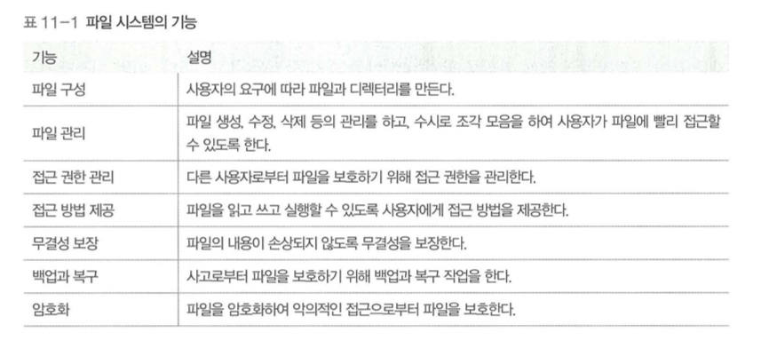

# Chapter 11. 파일 시스템

---

# 01. 파일과 파일 시스템

## 1.1 파일 시스템의 개요

> 파일을 보관하고 관리하는 파일 관리자를 두어 저장장치의 전체관리의 역할을 한다.
사용자의 요청에 따라 파일을 저장하거나 파일의 내용을 읽어온다.
> 

### 파일 관리자의 특징

- 파일 테이블을 이용한 파일 관리
- 파일 테이블을 사용하야 생성,수정, 삭제 등을 수행
- 사용 과정에서 읽기, 쓰기, 실행과 같은 다양한 접근방법 제공
- 사용자가 특정 파일에 접근시 파일 디스크립터라는 키를 얻어야 함

### 파일 시스템의 기능

<aside>
👀 파일을 구분하기 위해 이름과 확장자를 만들어 관리
파일의 정보는 파일의 헤더에 저장하여 관리

</aside>

데이터는 운영체제와 저장장치간에 블록 단위로 전송됨.

한 블록에 하나의 주소가 할당됨

디스크의 가장 작은 저장단위인 섹터를 묶어 하나의 블록을 만들고 이에 주소 배정

블록의 크기는 사용자가 직접 정할 수 있다.

블록크기를 작게 설정한 경우

- 내부 단편화 현상이 줄어듦
- 파일이 여러 블록으로 나뉘어 파일 입출력 속도가 느려짐

블록 크기를 크게 설정한 경우

- 큰 파일을 많이 사용할 때에 유리함 → 입출력 속도 빨라짐
- 단편화 현상 증가

포맷 시, 각 블록에 파일의 번호가 매겨짐

파일 테이블에는 파일이 어떤 블록에 있는지 명시

위의 예시에서는 파일 A를 요청했을 때, 1, 3, 9번 블록을 읽어 사용자에게 반환한다.

## 1.2 파일 분류와 확장자

<aside>
👀 파일은 논리적인 데이터의 집합으로 하드디스 크나 cd같은 제2저장장치에 저장됨
0과 1의 비트 패턴으로 이루어지며, 실행 파일과 데이터파일로 구분

</aside>

`실행 파일`

운영체제가 메모리로 가져와  cpu를 이용하여 작업하는 파일

사용자의 요청으로 프로세스가 된 파일

`데이터 파일`

실행 파일이 작업하는 데 필요한 데이터를 모아놓은 파일

사진 파일, 음악 파일, 문서 파일

스스로 프로세스가 될 수 없고, 운영체제가 전송하거나 보관하는데 쓰인다.

헤더에 파일의 이름, 버전, 크기, 만든 날짜, 접근 권한 등의 정보 저장(고유 헤더 보유)

## 1.3 파일 이름과 연결 프로그램

<aside>
👀  파일의 이름은 파일 이름. 확장자의 형태로 구성된다.

</aside>

이때 유의해야할 사항이 존재한다.

- 파일 이름에 마침표를 여러번 사용할 수 있다.
    - 마지막 마침표 다음 글자를 확장자로 인식
    - `run.2017.10.avi` 일 경우 마지막의 avi를 확장자로 인식한다.
- 파일이름은 현재 경로를 포함하여 최대 255자로 할 수 있다.

실행파일을 실행할 경우 프로세스가 생성이 되어 실행된다.

반면 데이터파일을 더블클릭 하면 해당 파일을 사용하는 응용프로그램이 실행된다.(연결 프로그램)

## 1.4. 파일 속성

파일에는 운영체제가 관리하는 `파일헤더`와 필요한 속성을 따로 정의한 `고유헤더`로 구분한다.

`파일헤더`

파일 테이블에서관리하며 파일의 이름, 종류, 크기, 시간, 접근 권한 등과 같은 
일반적인 내용이 담겨져 있다.

`고유헤더`

데이터 파일에 별도로 달려있으며

파일의 버전 번호, 크기, 특수 정보 등 응용 프로그램이 필요로하는 정보가 담겨 있다.

고유 헤더는 파일을 복구할 때 사용된다.

빠른 포맷을 수행 했을 때 파일테이블에서는 사라지지만 데이터 파일의 고유 헤더는 저장 장치에 남아있다 따라서 고유헤더가 갖고 있는 정보를 활용해 파일을 원래 상태로 복원한다.

## 1.5. 파일 구조

<aside>
💡 파일은 하나의 데이터 덩어리이다. 파일 구조는 이 데이터 덩어리를 어떻게 구성하느냐에 따라 순차 파일 구조, 인데스 파일 구조, 직접파일 구조로 나눌 수 있다.

</aside>

### 1.5.1 순차 파일 구조(Sequential file structure)

일반 파일은 기본적으로 순차 파일 구조이다.

파일 내용이 한 줄로 길게 늘어선 형태로 카세트 테이프가 대표적인 예시이다.

일반적인 동작은 전진, 후진 두가지 방식으로 이동하는데 이런 접근방식을 
순차접근이라 한다.

순차 파일구조 명령 순서

- open(), close() 명령을 사용하여 운영체제로부터 이용권한 획득
- `파일 디스크립터`를 사용자에게 전달(파일의 맨 앞에 위치)
    - 사용자가 read()혹은 write()명령을 내릴 시 파일 디스크립터 전진
    - 특정 위치로 파일 디스크립터를 옮겨야 할 때는 lseek()명령 수행

- 장점
    - 모든 데이터가 순서대로 기록되기 때문에 저장공간에 낭비되는 부분이 없다.
    - 구조가 단순하여 테이프는 물론 플로피디스크나 메모리를 이용한 
    저장장치에도 적용할 수 있다.
    - 순서대로 데이터를 읽거나 처리할때 매우 빠르게 처리된다.
- 단점
    - 새로운 데이터 삽입 삭제 시 시간이 많이 걸린다.]
    - 중간에 데이터 삽입/삭제 시 그 뒤의 데이터를 밀어내거나 당겨야함
        
        → 데이터의 변경이 잦은 경우에 적당하지 않음
        
    - 특정 데이터로 이동할 때 직접 접근이 어렵기 때문에 앞에서부터 순서대로 이동해야함
        
        → 데이터 검색에 부적절하다.
        

### 1.5.2 인덱스 파일 구조

순차 파일 구조에 인덱스 테이블을 추가하여 순차 접근과 직접 접근 가능

인덱스 테이블이 데이터의 시작 지점을 갖고 있기 때문에 특정 데이터에 직접적으로 접근 가능

- 장점
    - 복수의 인덱스 테이블을 통해 다양한 접근 가능(카테고리)
    - 빠른 접근을 수행하는 데 용이
    - 데이터 베이스같은 시스템에도 적용

### 1.5.3 직접 파일 구조(direct file structure)

직접 파일 구조는 저장하려는 데이터의 특정 값에 어떤 관계를 정의하여 물리
적인 주소로 바로 변환하는 파일 구조이다.

키값 쌍으로 구분

데이터 → 해싱함수 → 해당 데이터에 대한 물리적 레코드 주소를 계산하여 데이터 삽입

- 장점
    - 데이터 접근이 빠르다.
    - 데이터 접근 및 기록의 순서에는 제약이 없다.
- 단점
    - 데이터가 고르게 저장할 수 있는 함수를 찾아내야 한다.
    - 저장 공간이 낭비되는 문제가 있다.
    

# 2. 디렉토리의 구조

## 2.1. 디렉토리의 개념

<aside>
💡 디렉토리는 관련있는 파일을 하나로 모아놓은 곳
1개 이상의 자식 디렉토리를 가질 수 있으며 또한 1개이상의 파일을 가질 수 있다.

</aside>

최상위 디렉토리 → `루트 디렉토리`

최상위 디렉토리에서 `/`를 구분자로 사용하여 자식 디렉토리를 구분한다.

## 2.2. 디렉토리 파일

디렉토리또한 파일로 취급

일반 파일과 마찬가지로 헤더를 갖는다.

디렉토리 헤더에는 다음과 같은 정보가 기록된다.

- 이름
- 생성 시간
- 접근 권한

## 2.3. 마운트

`파티션`

논리적인 디스크 분할, 하나 혹은 여러개의 디스크를 파티션으로 나누어 사용한다.

ex) C드라이브, D드라이브, E드라이브

윈도우는 FAT16파일 시스템을 사용

최대 디스크는 32 GB

유닉스의 경우 서버용으로 만들어진 운영체제 파일 테이블의 크기 제한 없음

하나의 파일 테이블로 여러개의 디스크 혹은 파티션을 통합하여 관리할 수 있다.

파티션을 통합하여 하나의 파일 시스템으로 만들어 관리하는 것이 `마운트`라고 한다.

파티션 2의 루트 디렉토리를 파티션 1의 mnt 디렉토리에 붙여 두개의 파티션을 연결하였다.

- a.mp4의 경로는 /mnt/pref/a.mp4
- /mnt를 `연결 지점` 이라고 부른다.
- 사용자는 몇개의 파티션이 붙어있는지 모른다.

특징

- 다수의 파티션 통합 가능
- CD-ROM이나 USB메모리 같은 외부 저장 장치도 마운트로 
파티션에 붙이고 마운트 해제로 분리할 수 있다.

# 3. 디스크 파일 할당

## 3.1. 연속 할당과 불연속 할당

<aside>
💡 파일 시스템은 기본적으로 메인메모리 시스템과 유사하다.
디스크를 같은 크기로 나누고 각 공간마다 주소를 붙여서 관리 이를 `블록`이라한다.

</aside>

여러개의 블록에 대한 연결 방식에 따라 연속 할당, 불연속 할당 방식으로 구분한다.

- 연속 할당
    - 파일을 구성하는 데이터를 디스크 상에서 연속적으로 배열
    - 파일의 시작 블록을 알 경우, 전체 파일을 찾을 수 있다.
    - 단편화와 같은 문제로 인해 실제로 사용되지 않는다.
- 불연속 할당
    - 비어있는 블록에 데이터를 분산하여 저장하고 이에 대한 정보를 파일 시스템이 관리하는 방식
    - 대표 예시로 연결할당과 인덱스 할당이 있다.
    

### 3.1.1 연결 할당

<aside>
💡 파일에 속한 데이터를 연결리스트로 관리하는 방식

</aside>

- 관리 방식
    - 파일 테이블에는 시작 블록에 대한 정보만 저장한다.
    - 나머지 데이터는 시작 블록부터 연결하여 저장한다.
    - 파일의 맨 끝 블록에는 링크 대신 널 삽입
    - 연결 방식은 체인 할당이라고 부른다.
        
        
        
    
    - 테이블 형태로 관리된다.
    - ex) 윈도우의 FAT
    → FAT은 파티션 전체 블록에 대한 정보를 가진 테이블
    → 열의 개수가 파티션에 존재하는 블록의 개수와 같다.

- 특징
    - 하나의 파티션이 사용할 수있는 디스크의 용량이 테이블의 최소크기
        - → FAT16은 2^16이라 32GB가 최대이다.

### 3.1.2 인덱스 할당

<aside>
💡 테이블의 블록 포인터가 데이터의 인덱스를 담고있는 인덱스 블록을 연결한다.

</aside>

데이터가 0 2 4 에 담겨졌있다고 인덱스 플록에 표시되어 있으며 -1은 null을 의미한다.

- 특징
    - 파일제어 테이블이 가득 찰 경우 간접 인덱스 블록을 만들어 테이블 확장 가능
        - 파일 제어 블록
            - 파일 소유자와 각종 속성을 나타낸다.
            - 파일에 대한 모든 권한과 정보를 갖고 있다
            - 슈퍼블록이라고도 한다.
        - 블록 포인터
            - 데이터가 있는 블록의 위치를 연결하는 포인터
        - 간접 포인터
            - 블록 포인터가 다 찼을경우
            인덱스 블록을 생성한 후 간접 포인터를 생성하여 인덱스 블록을 연결
        - 이중/삼중 간접 포인터
            - 인덱스 블록 하나는 256개의 블록을 지정할 수 잇다.
            - 파일 크기가 커 인덱스 블록으로 연결할 수없는 경우 이중 간접 포인터 사용
            - 이중으로도 해결이 되지 않을 경우 삼중 간접 포인터를 사용한다.
    
    ## 3.2. 디스크 빈 공간 관리
    
    > 디스크는 같은 크기의 블록으로 나뉘며 블록 하나의 크기는 1~ 8KB 정도이다. 
    디스크 블록의 크기를 어떻게 정할 것인가는 메인메모리의 분할 문제와도 비슷하다. 
    블록 하나의 크기를 크게 잡으면 적은 주소로 많은 양의 데이터를 관리할 수 있지만 낭비되는 공간이 생기고, 반대로 블록 하나의 크기를 작게 잡으면 많은 양의 
    블록 포인터가 필요하다.
    > 
    
    블록 하나의 크기를 크게 잡을 경우 포인터의 개수는 줄어들지만 작은 크기의 파일이 
    들어왔을 때에 대해 `단편화 문제`를 피할 수 없다.
    
    디스크의 단편화를 줄이고 빈 공간에 대한 탐색을 빠르게 하기 위해 `빈 공간 리스트`를 사용한다.
    
    