# Chapter8. 가상 메모리의 기초

---

# 1. 가상 메모리 시스템

## 1.1가상 메모리 개요

> 컴퓨터마다 각각의 메모리를 갖고있으며 프로그램 실행 시, 
프로그램에 맞는 메모리가 없을 수 있다.

하지만 현대 메모리의 큰 특징은 물리 메모리의 크기와 프로세스가 올라갈 메모리의 위치를 신경 쓰지 않고 
프로그래밍 하도록 지원한다는 것이다.
 이를 **가상 메모리**라고 부른다.
> 

### 1.1.1 가상 메모리의 크기와 주소

> 가상 메모리는 메모리 위치와 상관없이 0번지부터 시작하는 메모리 공간을 갖는다.
> 

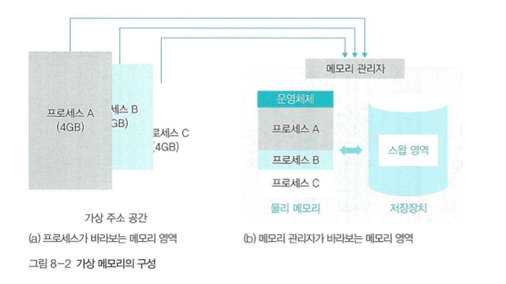

- 가상 메모리의 최대 크기는 컴퓨터 시스템의 물리 메모리의 최대 크기
- CPU의 비트에 따라 결정된다(32bit → 4GB, 64bit → 8GB)
- 물리 메모리를 초과하는 프로세스가 실행 될 경우 가상 메모리 시스템에서는
    - 물리메모리 일부를 하드디스크의 일부 공간인 `스왑영역` 으로 이동시킨다. → `swap out`
    - 프로세스가 작업을 마치면 `스왑영역`에 있는 프로세스를 메모리로 가져온다 → `swap in`

<aside>
👀 스왑 영역
하드디스크에 존재하지만 메모리 관리가자 관리하는 영역으로서
메모리의 일부이며, 가상 메모리 구성 요소 중 하나이다.

따라서 가상 메모리에서 메모리 관리자가 사용할 수 있는 메모리의 전체 크기는
`물리 메모리` + `스왑 영역`의 크기이다.

</aside>

### 1.1.2. 가상 메모리의 메모리 분할 방식

> 실제 메모리에 있는물리 주소 0번지는운영체제 영역이므로 일반프로세스가 사용할수 없다. 
따라서 가상 메모리 시스템에서는 운영체제를 제외한 나머지 메모리 영역을 일정한 크기로
나누어 일반 프로세스에 할당한다.
> 

### 1.1.3 분할 방식

- 세그멘테이션 기법
    - 가변 분할 방식 사용
    - 외부 단편화 문제로 인한 사용x

- 페이징 기법
    - 고정 분할 방식 사용
    - 페이지 관리 어려움 존재

→ 두 기법의 단점을 보완한 `세그멘테이션-페이징 혼용` 기법을 사용한다.

# 2. 매핑 테이블

> 가상 메모리 시스템에서 가상 주소는 실제로 물리 주소나 스왑 영역 중 한 곳에 위치하며, 메모리 관리자는
가상 주소와 물리 주소를 일대일 매핑 테이블로 관리한다.
> 

![Untitled]
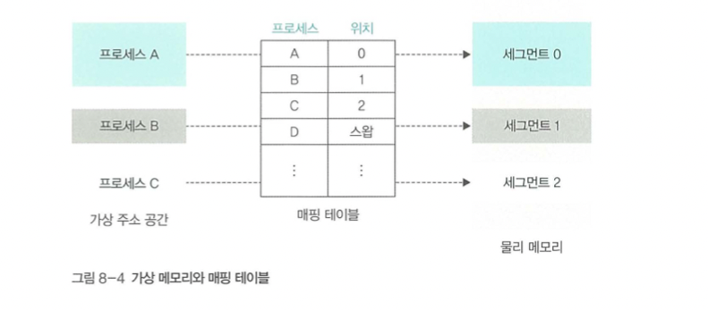

### 예시 구성

- 프로세스 A(가상 주소)는 물리 메모리의 세그먼트 0에 위치
- 프로세스 B(가상 주소)는 물리 메모리의 세그먼트 1에 위치
- 프로세스 D의 경우 스왑 영역에 위치

위와 같은 상황에서 프로세스 A의 어떤 값이 필요할 때는 세그먼트 0에서 원하는 데이터를 가져오면 된다.

# 2. 페이징 기법

> 고정 분할 방식으로 메모리를 분할하여 관리하는 페이징 기법
물리 주소 공간을 같은 크기로 나누어 사용한다.
> 

## 1. 페이징 기법의 구현

![Untitled]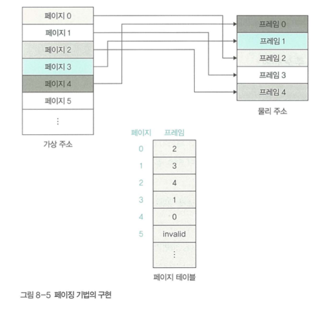

페이지

- 가상 메모리 주소는 항상 0번지 부터 시작
- 가상 주소의 분할된 각 영역은 
`**페이지**`라고 부른다.
- `**페이지**`별 번호를 매겨 관리
    
    

프레임

- 물리메모리의 영역은 **`프레임`**이라 부른다.
- **`프레임`**은 분할된 영역에 대해 번호를 매겨 관리한다
- **`페이지`**와 **`프레임`**의 크기는 같다.

페이지 테이블

- 하나의 페이지가 무작위의 프레임에 매핑되어 있다.
- 연결 정보는 페이지 테이블에 담겨있다.
- 페이지 테이블은 하나의 열로 구성
- 스왑 영역에 있는 페이지는 별도로 표시(invalid)

## 2. 페이징 기법의 주소 변환

### 2.1 주소 변환 과정

![Untitled]
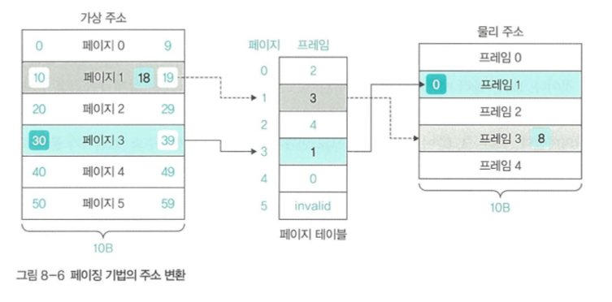

### 조건

- 가상 주소공간과 물리 주소공간을 10B로 분할
- 페이지와 프레임은 10개의 주소를 가진다.

### 가상 주소에서 물리 주소 변환 과정

1. 가상 주소 30번지가 어느 페이지에 있는지 탐색 → 30번지는 페이지 3의 0번째 위치
2. 페이지 테이블의 페이지 3로 이동 후 해당 페이지에 프레임 1이 있음을 확인
3. 물리 메모리 프레임 1의 0번째 위치에 접근

### 값 저장 과정에서의 주소 변환 과정

- 가상 주소 18번지에 값 저장
1.  가상 주소 18번지가 어느 페이지에 있는지 확인 (페이지 1의 8번 위치)
2. 페이지 테이블의 1로 이동 (프레임 3 위치 확인)
3. 프레임 3의 8번 위치에 저장 

### 2.2 정형화된 주소 변환

> 페이징 기법에서는 가상 주소를 $PA=<F, D>$로 표현한다.
VA 는 가상 주소 (virtual address)
P 는 페이지 (page)
D는 페이지의 처음위치부터 해당 주소까지의 거리 (distance 혹은 오프셋) 
를 의미한다
> 

위 가상 주소에서 물리 주소 변환 과정에서 나온 30번지의 탐색은 $VA=<3, 0>$ 으로 표현 가능

여기서 가상 주소에서 물리주소의 변환은 

$VA=<P, D>$ to $PA=<F, D>$이다.

 

변환 과정에서는 페이지 테이블 사용

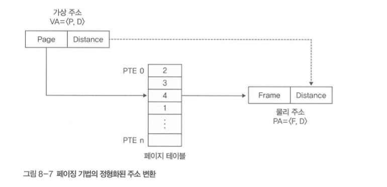

- 페이지 테이블에서 페이지 번호를 찾아 프레임 탐색
- 페티지 테이블은 페이지 번호, 프레임 번호로 구성
- 각각의 한줄은 페이지 테이블 엔트리(Page Table Entry)라 부른다.
- 페이지 테이블 엔트리는 프레임 번호만 갖는다. 
(페이지 테이블에 페이지 번호가 0부터 정리 되어 있기 때문)

## 3. 페이지 테이블 관리

> 시스템에는 여러개의 프로세스가 존재하고 프로세스마다 페이지 테이블이 하나씩 있다.
따라서 전체 페이지 테이블의 크기는 프로세스의 수에 비례해서 커진다.
이로인해 테이블 관리가 복잡해진다.
> 

위의 그림과 같이 모든 프로세스의 일부 페이지가 프레임에 올라와 있으며
이를 관리하기 위해 프로세스마다 페이지 테이블을 운영 중이다.

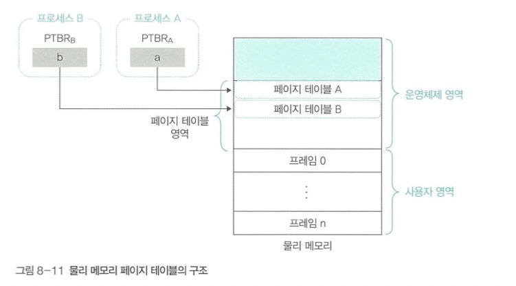

<aside>
👀 위의 그림에서 처럼 프로세스가 메모리에 빠르게 접근하기 위해 메모리 관리자는 
페이지 테이블의 시작 주소를 **테이블 기준 레지스터(Page Table Base Register)**에 보관한다.

이는 각 프로세스의 프로세스 제어 블록에 저장되는 데이터로, 
물리 메모리 내에 페이지 테이블의 시작 주소를 가지고 있다.

</aside>

## 4. 페이지 테이블 매핑 방식

> 시스템 내에는 여러 개의 프로세스가 존재하며 각 프로세스는 하나의 페이지 테이블을 가지며
페이지 테이블은 운영체제 영역에 있다.
사용할 수 있는 물리 메모리 영역이 적을 경우 페이지 테이블 또한 스왑 영역으로 옮겨진다.
> 

- 직접 매핑
    - 페이지 테이블 전체가 물리메모리의 운영체제 영역에 존재하는 방식
    - 부가 작업 없이 주소 변환 가능
- 연관 매핑
    - 페이지 테이블 전체를 스왑 영역에서 관리하는 방식
    - 물리 메모리 여유 공간이 작을 때 사용하는 방식
    - 모든 페이지 테이블을 저장 장치의 스왑 영역에 저장
    - 일부 내용을 무작위 배치하기 떄문에 페이지번호, 프레임 번호 둘 다 표시
- 집합-연관 매핑
    - 페이지 테이블 전체를 스왑 영역에서 관리
    - 페이지 테이블을 일정한 집합으로 자르고, 자른 덩어리 단위로 물리 메모리에 가져온다.
    - 위 그림에서는 페이지 테이블을 5개씩 잘라서 구성
    - 새로 생성한 테이블에는 자른 페이지 테이블이 물리 메모리에 있는지 스왑영역에 있는지 표시
    - 집합 2에 속한 페이지는 물리 메모리의 180 번에 위치
    - 집합 테이블을 통해 테이블 위치 파악
    - 연관 매핑에 비해 주소 변환 시간 단축
- 역매핑
    - 물리메모리의 프레임 번호를 기준으로 테이블 구성
    - 물리 메모리의 어떤프레임에 어떤 프로세스의 어떤 페이지가 올라와 있는지 표시
    - 프로세스 아이디와 페이지 번호로 구성
    - 한개의 테이블이기 때문에 테이블의 크기가 작다는 장점
    - 프로세스가 가상메모리에 접근 시, 프로세스 아이디와 페이지 번호를 찾아야 하는 단점이 있다.
    - 예시로 번호가 없을 시 모든 테이블을 검색 후 스왑영역에 있음을 알림

### 4.1. 직접 매핑

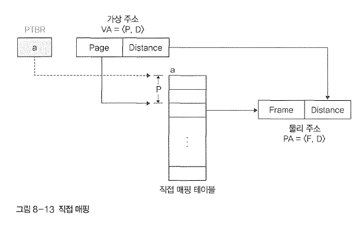

페이지 테이블 전체가 물리 메모리에 저장

가상 주소 VA= <P, D〉를 물리 주소 PA= <F, D〉로 변환하려면
페이지 테이블의 P 번째 위치 (PTE P)에서 원하는 프레임 값을 얻을 수 있다. 
페이지 테이블의 시작 주소는 페이지 데이블 기준 레지스터 PTBR가 가지고 있으므로 물리 메모리상 페이지 데이블의 P 번째 주소가 시작 주소 PTBR로부터 P 번째 위치에존재한다.

### 4.2. 연관 매핑

**연관 매핑 동작 구성**

1. 전체 페이지 테이블을 스왑 영역에 두고 페이지 테이블의 일부를 물리 메모리에 가져오는 방식
2. 물리 메모리에는 일부 페이지 무작위 저장
3. 이를 변환 색인 버퍼 혹은 연관 레지스터라 부른다.
4. 변환색인 버퍼는 페이지 번호와 프레임 번호로 구성

**동작**

- 캐시 시스템과 유사
- 원하는 메모리에 접근하기 위해 변환 색인 버퍼 탐색
- 버퍼에 있는 경우 히트 → 물리 주소로 변환
- 버퍼에 없는 경우 미스 → 스왑 영역에 저장된 직접 매핑 테이블 사용하여 프레임 번호 변환
- 미스가 자주 발생할 경우 성능이 떨어진다.

### 4.3. 집합-연관 매핑

동작 구성

- 페이지 테이블을 같은 크기의 여러 묶음으로 나눔
- 묶음의 시작 주소를 가진 디렉토리 테이블을 만들어 관리
- 전체 페이지 테이블은 스왑 영역에 상주, 일부 테이블은 묶음단위로 메모리로 이동
- 디렉토리 테이블에서 테이블 묶음의 위치를 파악할 수 있음
- TLB 미스를 낮출 수 있다.
- VA= <P, D〉가 아니라 VA= <Pl, P2, D〉로 구성
    - P1은 디렉토리 테이블에서 위치 정보
    - P2는 묶음 내에서의 위치 정보를 나타낸다.
    - 두 단계를 거쳐 물리주소로 변환

### 4.4. 역매핑

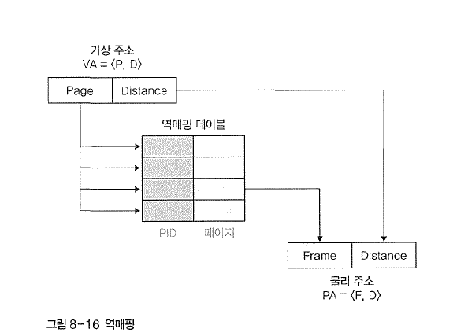

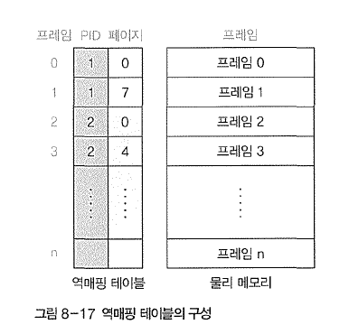

물리 메모리의 프레임 번호 기준으로 테이블 작성

- <프레임 번호, 프로세스 아이디, 페이지 번호>로 구성
- 테이블의 행 수는 실제 프레임과 일치
- 항상 일정 크기의 테이블 유지

**역 매핑 동작**

- 메모리 관리자는 테이블에서 프로세스 아이디와 페이지 번호 검색
- 테이블에 데이터가 없다면 스왑 영역에서 가져온다.
- 데이터를 찾을 때까지 테이블을 탐색하기 때문에 검색 시간 낭비

# 3. 세그먼테이션 기법

> 가변 분할 방식을 이용한 가상 메모리 관리 기법
물리 메모리를 프로세스의 크기에 따라 가변적으로 나누어 사용
> 

## 1. 세그먼테이션 기법의 구현

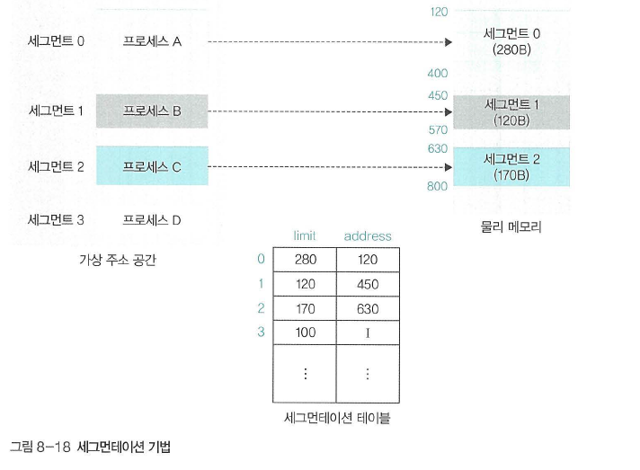

세그먼 테이션 기법도 마찬가지로 매핑 테이블 사용

이를 `**세그먼테이션 테이블**` 혹은 `**세그먼테이션 매핑 테이블**`이라고 한다.

**특징**

- 세그먼트의 크기를 나타내는 limit →
    - 메모리 보호의 역할을 한다.(trap 오류)
- 물리 메모리상의 시작 주소를 나타내는 address
- 프로세스의 크기에 따라 메모리 분할 방식
- 물리 메모리 부족 시 스왑영역 사용

**장단점**

- 페이지 테이블이 작고 단순하다
- 외부 단편화로 인해 물리 메모리 관리가 복잡하다.

## 2. 세그먼테이션 기법의 주소변환

가상 주소를 $VA=<S, D〉$로 표현한다.

s는 세그번트 번호, d는 세그먼트 시작 지점에서 해당 주소까지의 거리를 의미한다.

0부터 시작하므로 D는 사용자가 지정한 주소 그 자체

### 주소 변환과정

조건

프로세스 A - 세그먼트 0

프로세스 B - 세그먼트 1

프로세스 C - 세그먼트 2

프로세스 A의 32번지에 접근

1. 가상의 주소를 구한다. 프로세스 A는 세그먼트 0
S  =0 D = 32  → $VA=<0, 32〉$가 된다.
2. 세그먼테이션 테이블에서 세그먼트 0의 시작 주소를 알아낸 후 
시작 주소 120에 거리 32를 더하여 물리주소 152번지를 구한다.
거리가 세그먼트 limit보다 큰지 점검한다.(클 경우 메모리 오류 출력후 프로세스 종료)
3. 물리 주소 152번지에 접근하여 원하는 데이터를 읽거나 쓴다.

# 4. 세그먼테이션-페이징 혼용 기법

페이징 - 물리 메모리를 같은 크기로 나누어 관리 → 페이지 테이블의 크기가 트다

세그먼테이션 - 페이지 테이블의 크기를 작게 유지가 가능 → 외부 단편화로 인한 추가 관리 필요

## 1. 메모리 접근 권한

> 메모리 접근 권한은 메모리 특정 번지에 저장된 데이터를 사용할 수있는 권한으로
읽기, 쓰기, 실행, 추가 권한이 있다. 총 8가지의 접근방식이 존재한다.
> 

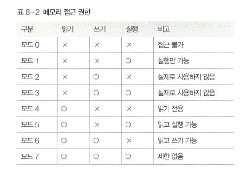

읽기 권한 없이 쓰기 권한은 존재할 수 없으므로 모드 2, 3은 사용되지 않으며 
추가 권한의 경우에는 쓰기 권한없이 사용할 수 없다.

프로세스의 구성

- 코드 영역
    - 몸체, 동작을 담당
    - 자기 자신을 수정할 수 없기 때문에 읽기 및 실행권한
- 데이터 영역
    - 프로세스가 사용하는 데이터를 저장
    - 일반적인 변수는 읽거나 쓰기 권한을 갖는다
    - 상수는 읽기 권한만 갖는다.
- 스택 영역
- 프로세스 제어 블록

<aside>
💡 메모리 접근 권한 검사는 가상 주소에서 물리 주소로 주소변환이 일어날 때 발생한다.

읽기만 가능한 메모리 영역에 쓰기 수행 시 메모리 오류 `**트랩**` 발생

모든 메모리 관리 기법은 메모리 접근 권한에 대한 정보를 갖고 있으며 주소변환이 발생할 때마다 유용한 접근인지 아닌지 검사한다.

</aside>

## 2. 세그먼테이션-페이징 혼용 기법의 도입

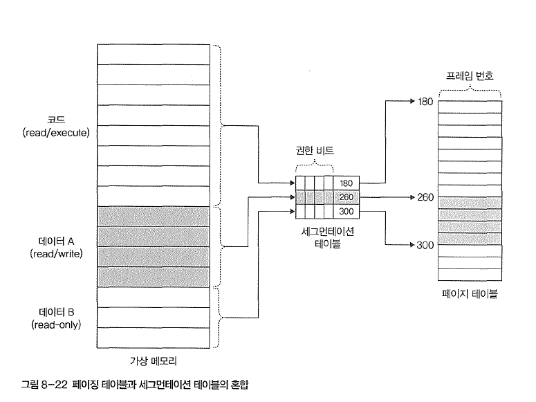

- 가상 메모리와 관련있는 영역을 세그먼테이션 테이블의 한 부분과 묶어서 관리, 해당 부분을 시작 주소로 잡아 페이지 테이블에 접근하는 방식으로 사용

특징

- 테이블의 크기를 줄일 수 있다.
- 현재 대부분의 운영체제는 이 방식 사용

## 3. 혼용 기법의 주소변환

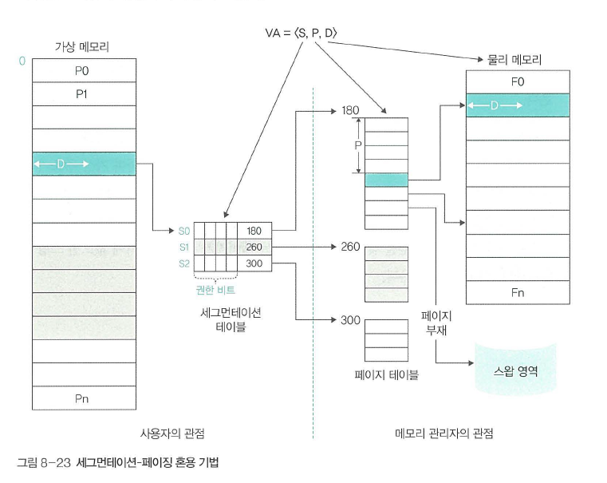

> 여기서는 가상 주소를 $VA = <S, P, D>$ 로 표현한다.
> 
- S는 세그먼트 번호
- P는 페이지 번호
- D는 페이지의 처음 위치에서 해당 주소까지의 거리

**과정**

1. 사용자가 어떤 주소에 있는 데이터를 요청하면 해당 주소의 위치를 계산 VA = <S,P,D>를 구함
2. 세그먼트 테이블의 해당 세그먼트 번호로 이동 후
메모리를 벗어나는지, 없는 권한에 접근하는지 확인
3. 페이지 테이블에서 페이지가 어느 프레임에 저장되어 있는 지 찾는다.
    1. 있을 경우 메모리에 접근
    2. 없을 경우 스왑 영역으로 이동
4. 물리 메모리의 프레임 처음 위치에서 D만큼 떨어진 곳에서 데이터를 읽거나 쓴다.
