# 가상 메모리 관리

## 1. 요구 페이징

### 요구 페이징의 개요

- 사용자가 요구할 때 해당 페이지를 메모리로 가져가는 것
- 필요한 모듈만 메모리에 올려 사용함
    - 적은 양의 메모리를 관리하여 효율적으로 관리할 수 있다
    - 메모리 입출력을 줄여 응답속도를 향상시킬 수 있다

### 페이지 테이블 엔트리의 구조

- 가상메모리는 물리 + 스왑 영역
- 스왑 영역은 hdd에 존재하는 영역
- 메모리로 올리는 것을 스왑인, 스왑영역으로 내보내는 것을 스왑아웃이라고 함

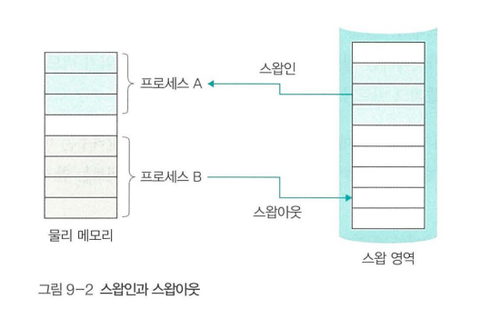

- 페이지 테이블 엔트리(PTE)는 페이지 테이블의 한 행
- 페이지 번호, 플래그 비트, 주소 필드로 나뉨

    - 접근 비트(access bit) : 물리 메모리에 올라온 후 실행된 적이 있는 지
    - 변경 비트(modified bit) : 물리 메모리에 올라온 후 데이터가 변경되었는 지(데이터 오염)
    - 유효 비트(valid bit) : 데이터가 스왑 영역에 있는 지
    - 읽기, 쓰기, 실행 비트(read, write, execute bit) : 각각의 권한을 나타냄

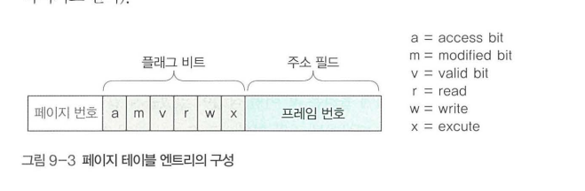

### 페이지 부재

- 유효 비트를 사용하여 물리 메모리에 올려져 있는 지 확인하는데, 데이터가 없을 경우 교체한다
- 유효 비트에 따라 주소 필드가 바뀐다
    - 0일때, 물리 메모리에 데이터가 있으므로 프레임 번호
    - 1일때, 스왑영역에 데이터가 있으므로 저장장치 내 주소

- 세그멘테이션 오류는 프로세스가 사용할 수 있는 메모리 영역을 벗어나거나 접근 권한이 없을 때 발생하므로 페이지 부재와 연관이 없다
- 페이지 부재 시뮬레이션(D, E 요구)

### 지역성

- 기억 장치에 접근하는 패턴이 특정 영역에 집중되는 성질
- 공간의 지역성 : 현재 위치에서 가까운 데이터에 접근할 확률이 높음
- 시간의 지역성 : 현재 시간에서 가까운 시간의 데이터에 접근할 확률이 높음
- 순차적 지역성 : 여러 작업이 순서대로 진행되는 경향(공간 지역성의 특별한 경우)
- goto 사용할 경우 지역성을 해침

## 2. 페이지 교체 알고리즘

### 페이지 교체 알고리즘의 개요

- 스왑 영역으로 보낼 페이지를 결정하는 알고리즘
- 사용할 가능성이 적은 페이지를 대상 페이지로 선정한다

#### 페이지 교체 알고리즘의 종류

- 구현이 쉬운 간단한 알고리즘
- 구현이 사실상 불가능한 최적 알고리즘
- 이상적인 방식과 유사하게 구현한 최적 근접 알고리즘

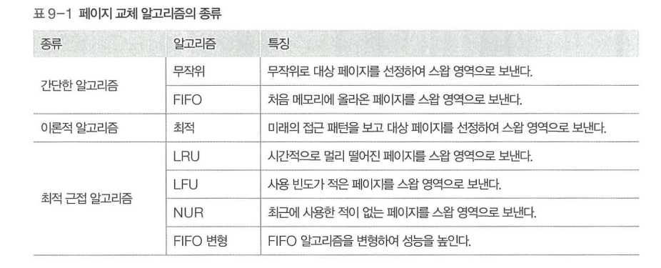

#### 페이지 교체 알고리즘의 성능 평가 기준

- 페이지 부재 횟수, 평균 대기 시간, 전체 작업에 걸리는 시간 등을 체크
- 아무리 성능이 좋아도 계산이 많이 필요하거나 메모리를 많이 사용하면 좋지 않음

### 메모리 패턴

### 무작위 페이지 교체 알고리즘

- 스왑 영역으로 무작위하게 보냄
- 사용x

### FIFO 페이지 교체 알고리즘

- 큐로 구현, 페이지 부재 시 가장 먼저 들어온 페이지를 교체
- 개선된 버전인 2차 기회 FIFO 알고리즘이 있음

### 최적 페이지 교체 알고리즘

- 앞으로 사용할 페이지를 예측하여 교체
- 사실상 구현 불가능

### LRU 페이지 교체 알고리즘

- Least Recently Used, 가장 오래된 페이지를 교체
- 접근 시간, 카운터, 참조 비트 시프트로 구현할 수 있음
- 오래된 페이지를 파악하기 위해 시간을 기록하므로 메모리 차지
- FIFO보다 성능 좋음

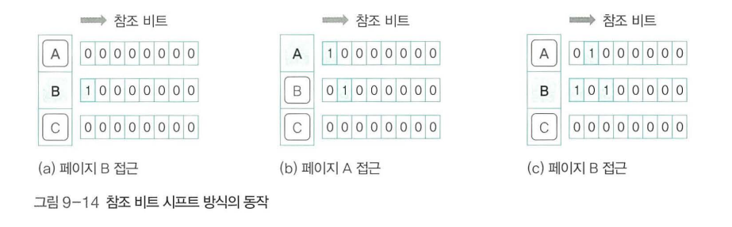

### LFU 페이지 교체 알고리즘

- Least Frequently Used, 가장 적게 사용된 페이지를 교체
- 사용 빈도를 파악하기 위해 접근횟수를 기록하므로 메모리 차지
- FIFO보다 성능 좋음

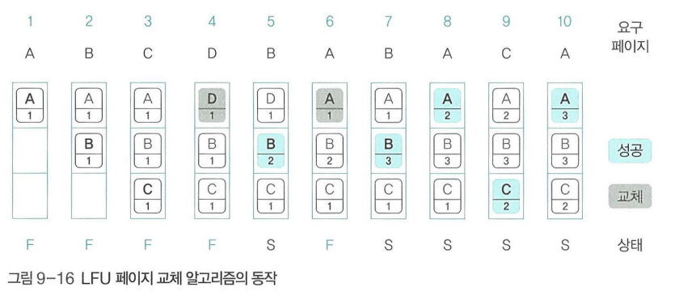

### NUR 페이지 교체 알고리즘

- Not Used Recently, 최근 사용되지 않은 페이지를 교체
- 참조, 변경 비트를 기준으로 페이지 교체(우선 순위는 변경 > 참조)
- (참조, 변경) (0, 0) > (0, 1) > (1, 0) > (1, 1)
- 둘 다 1일 경우 모두 0으로 초기화
- 성능이 좋고, 메모리를 적게 사용(2bit)하여 가장 많이 사용

### FIFO 변형 알고리즘

#### 2차 기회 페이지 교체 알고리즘

- FIFO에서 페이지 부재 없이 성공 시 큐의 맨 뒤로 보냄(사실상 페이지 접근 시 큐의 맨 뒤로 보냄)
- LRU, LFU, NUR보다 성능이 약간 낮음

#### 시계 알고리즘

- 2차 기회 페이지 교체 알고리즘과 유사하나 원형 큐를 사용
- 원형으로 포인터를 돌리면서 페이지 교체
- 참조 비트를 사용하여 기회를 한번 더 줌
- 메모리는 NUR보다 적지만, 알고리즘이 복잡하고 계산량이 많음

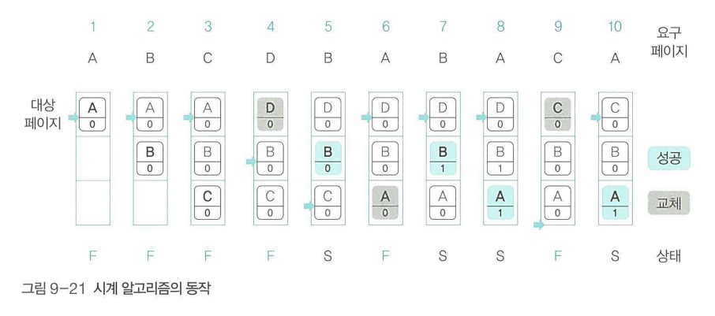

## 3. 스레싱과 프레임 할당

### 스레싱의 개념

- 물리 메모리에 충분한 공간이 없을 경우 페이지 교체가 자주 일어나 멈춘 것처럼 보이는 현상을 스레싱이라고 함

#### 물리 메모리의 크기와 스레싱

- 동시에 실행하는 프로그램 수를 멀티 프로그래밍 정도라고 함
- 멀티 프로그래밍 정도가 높으면 스레싱 발생
- 페이지 교체가 많이 일어나는 순간을 스레싱 발생 지점이라고 함

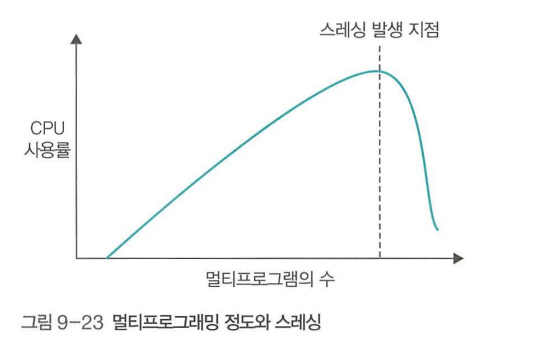

#### 스레싱과 프레임 할당

- 나눠주는 프레임이 너무 작으면 페이지 부재가 자주 일어나고, 너무 크면 메모리의 낭비가 심해진다
- 동적 할당과 정적 할당이 있다

### 정적 할당

- 프로세스 실행 초기에 프레임을 나눠주고 크기를 고정시키는 방법

#### 균등 할당

- 프로세스의 크기에 상관없이 같은 크기의 프레임을 할당
- 큰 프로세스의 페이지 교체가 많이 일어날 수 있음

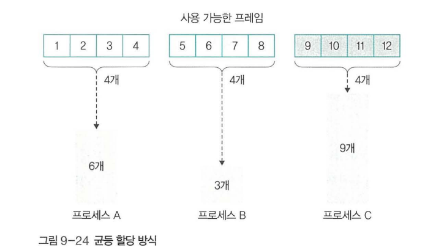

#### 비례 할당

- 프로세스의 크기에 비례하는 크기의 프레임을 할당
- 큰 프로세스라도 많은 메모리를 사용하지 않을 수 있고, 작은 프로세스라도 많이 필요로 할 때도 있음(동영상 플레이어등)

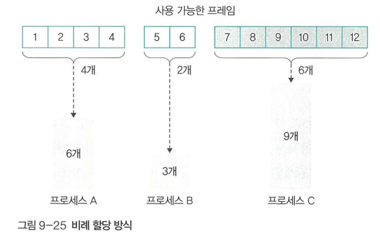

### 동적 할당

- 프로세스가 요구하는 프레임을 동적으로 할당

#### 작업집합 모델

- 지역성 이론을 바탕으로 함
- 일정 시간동안 참조된 페이지를 집합으로 만들고, 물리 메모리에 유지
- 물리 메모리를 유지할 크기를 작업집합 크기라고 함
- 작업집합에 포함되는 페이지의 범위를 작업집합 윈도우라고 함
- 작업집합 크기에 도달하면 작업집합을 갱신하는데 작업집합 윈도우의 데이터를 기반으로 작업집합을 설정함
- 윈도우가 너무 크거나 작으면 문제

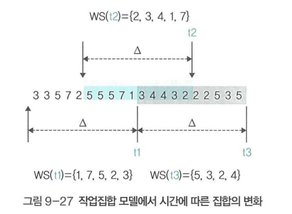

#### 페이지 부재 빈도

- 페이지 부재 횟수를 기록하여 페이지 부재 비율이 상한선과 하한선 사이를 이동할 수 있게 함
- 상한선이면 프레임을 더 할당하고, 하한선이면 프레임을 회수함

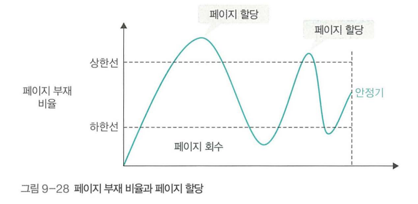

## 4. 프레임 관련 이슈

### 전역 교체와 지역 교체

- 전역 교체 : 전체 프레임 교체
- 지역 교체 : 현재 실행중인 프로세스의 프레임 교체
- 전역 교체의 경우 많은 데이터를 한 번에 교체하여 성능이 좋으나 다른 프로세스의 프레임을 뺏어 스레싱을 일으킬 수 있음
- 지역 교체의 경우 페이지 교체가 자주 일어날 수 있음

### 페이지 테이블 크기

- 운영체제마다 1024KB ~ 4MB의 다양한 페이지 테이블을 가지고 있음
- 시간이 지날수록 페이지 테이블이 점점 커지는 추세

### 쓰기 시점 복사

- 데이터의 변화가 있기 전까지 복사를 최대한 미루는 방식

