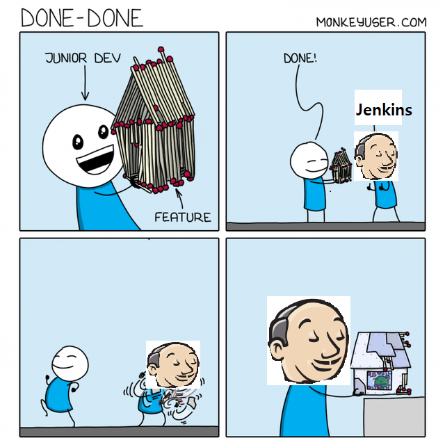
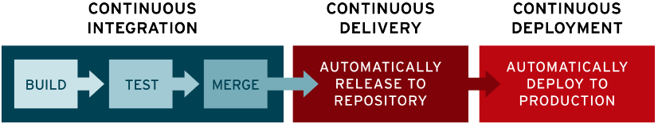

# CS01/20(Jenkins)

# Jenkins?

---



---

모든 언어의 조합과 소스 코드 레포지토리에 대한 **지속적인 통합(Continuous integration, CI)**
과 **지속적 배포(continuous delivery, CD)** 환경을 구축하기 위한 도구다. 빌드, 테스트, 배포 프로세스를 자동화하여 소프트웨어 품질과 개발 생산성을 높일 수 있다.

## CI/CD?

---



- **CI**: 지속적 통합(continuous integration)을 통해 개발자들은 **코드 변경 사항을 공유 브랜치 또는 "트렁크"로 다시 병합하는 작업을 더욱 수월하게 자주 수행**할 수 있습니다. 예를 들어, merge day를 통해서 각자의 개발자가 작업했던 소스코드를 통합하려 할 때, 공통된 섹션에서 코드 수정이 있을 경우 충돌이 발생하게 되는데, 이때 소스코드들을 테스트하고 merge하는 것을 자동화하는 기술입니다.
 뿐만 아니라, 테스트 자동화로 머
- **CD:** 지속적 제공(continuous delivery)의 빌드 자동화, 유닛 및 통합 테스트 수행 후, **이어지는 지속적 제공 프로세스에서는 유효한 코드를 리포지토리에 자동으로 릴리스**합니다.
- CD: 지속적 배포(continuous deployment)를 통하여 리포지토리에 릴리스된 제품을 자동으로 배포합니다. 여기서 지속적 배포가 효율적으로 이루어 지기 위해선, 테스트 자동화가 제대로 설계되어있어야 합니다.

### **⇒ Jenkins? CI/CD 파이프라인 환경을 구축하기 위한 도구!**

## 기능

---

- 젠킨스와 같은 CI툴이 등장하기 전에는 일정시간마다 빌드를 실행하는 방법이 일반적이었는데, 젠킨스는 SVN, Git과 같은 **버전 관리 시스템과 연동해서 소스의 커밋을 감지하면 자동적으로 자동화 테스트가 포함된 빌드가 작동**하도록 도와주게 되어 편의성이 증가되었다.

- **컴파일 오류를 검출**하고, **자동화 테스트를 수행**하며, **정적 코드 분석으로 인한 코딩 규약 준수 여부를 체크**하고 프로파일링 툴을 이용한 **성능 변화 감시**, 결합 테스트 환경에 대한 배포 작업의 큰 도움을 준다.

## 설치

---

](img/Untitled%201.png)

출처: [https://yeonyeon.tistory.com/56](https://yeonyeon.tistory.com/56)

- 젠킨스 홈페이지에서 설치파일 다운로드 후 Account와 Password 지정


- 포트번호 지정


- JDK 지정


- 자신의 화면에 나온 경로에 들어가 initialAdminPassword를 확인하고 입력


- 계정 생성

## SVN과 연동하기

---

](img/Untitled%206.png)

출처: [https://yeonyeon.tistory.com/59](https://yeonyeon.tistory.com/59)

- Jenkins에서 새 item 생성


- Jenkins 프로젝트 설정


- credential 설정


- 빌드를 통해 연동 확인
    - 파란불 : 연동 완료
    - 빨간불 : 오류 로그 확인 필요

## Pipleline을 이용한 Junit 연동

---

- pipeline script 작성

```jsx
pipeline 
{
    agent any
    
    tools { 
        gradle 'gradle'
    }
    
    stages 
    {
        stage ('Checkout') 
        {
            steps {
                git credentialsId: 'yeon-06', url: '깃주소'
            }       
        }
        stage ('Build')
        {
            steps {
                bat "./gradlew.bat build"
            }
        }
        stage('JUnit Test'){
            steps{
                junit '**/build/test-results/test/*.xml'
            }
        }
    }
}
```

**ERROR**

- **Execution failed for task ':compileJava'.**
    - Java의 경로가 jre로 설정되어 있을 경우 입니다. jdk 내에 존재하는 tools.jar을 이용해야 하므로 경로를 jdk로 재설정 합시다.
- **ERROR: No test report files were found.**
    - test report의 위치 잘 확인하고 입력해야 합니다..
    - gradle 3.0 이전에는 '**/build/test-results/*.xml' 위치에 있었다고 합니다.

## 결과

---

